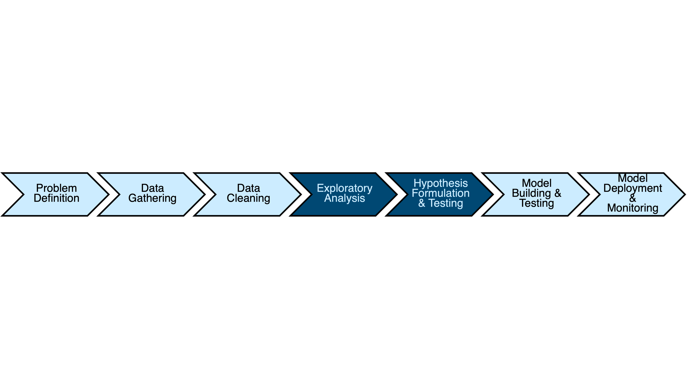

# Data Processing Workflow with Dask
## Summarizing and Analyzing DataFrames




```python
# Before beginning, set your working directory to where the data resides
import os
os.chdir('nyc_parking_violations')
```

### Calculating Descriptive Statistics with Dask


```python
# Loading the data for analysis
import dask.dataframe as dd
import pyarrow
from dask.diagnostics import ProgressBar

nyc_data = dd.read_parquet('nyc_final', engine='pyarrow')
```


```python
# Checking the Vehicle Year column for anomalies
with ProgressBar():
    vehicle_age_by_year = nyc_data['Vehicle Year'].value_counts().compute()
vehicle_age_by_year
```

    [########################################] | 100% Completed |  0.8s


    0.0       8596251
    2013.0    2846851
    2014.0    2733039
    2015.0    2423990
    2012.0    2070360
               ...   
    2038.0         16
    2034.0         14
    2039.0         14
    2043.0         13
    2035.0          9
    Name: Vehicle Year, Length: 100, dtype: int64


```python
# Filtering out the bad data
with ProgressBar():
    condition = (nyc_data['Vehicle Year'] > 0) & (nyc_data['Vehicle Year'] <= 2018)
    vehicle_age_by_year = nyc_data[condition]['Vehicle Year'].value_counts().compute().sort_index()
vehicle_age_by_year
```

    [########################################] | 100% Completed |  1min  0.4s


    1970.0        775
    1971.0        981
    1972.0        971
    1973.0        977
    1974.0        786
    1975.0        949
    1976.0        910
    1977.0       1276
    1978.0       1481
    1979.0       1887
    1980.0       1996
    1981.0       1877
    1982.0       2164
    1983.0       3277
    1984.0       5351
    1985.0      10365
    1986.0      23731
    1987.0      32087
    1988.0      69377
    1989.0      41674
    1990.0      77031
    1991.0      29877
    1992.0      60789
    1993.0      65870
    1994.0      93404
    1995.0     201606
    1996.0     219047
    1997.0     372041
    1998.0     417273
    1999.0     535844
    2001.0     857291
    2002.0    1001788
    2003.0    1155400
    2004.0    1345823
    2005.0    1470302
    2006.0    1600032
    2007.0    1801081
    2008.0    1528735
    2009.0    1210117
    2010.0    1362354
    2011.0    1683653
    2012.0    2070360
    2013.0    2846851
    2014.0    2733039
    2015.0    2423990
    2016.0    1280706
    2017.0     297496
    2018.0       2491
    Name: Vehicle Year, dtype: int64


```python
# Calculating the vehicle age at the date of citation
nyc_data_filtered = nyc_data[condition]

def age_calculation(row):
    return int(row['Issue Date'].year - row['Vehicle Year'])

vehicle_age = nyc_data_filtered.apply(age_calculation, axis=1, meta=('Vehicle Age', 'int'))

nyc_data_vehicle_age_stg1 = nyc_data_filtered.assign(VehicleAge=vehicle_age)
nyc_data_vehicle_age_stg2 = nyc_data_vehicle_age_stg1.rename(columns={'VehicleAge':'Vehicle Age'})

nyc_data_with_vehicle_age = nyc_data_vehicle_age_stg2[nyc_data_vehicle_age_stg2['Vehicle Age'] >= 0]
```


```python
# Saving the intermediate results to parquet
with ProgressBar():
    files = nyc_data_with_vehicle_age.to_parquet('nyc_data_vehicleAge', engine='pyarrow')

nyc_data_with_vehicle_age = dd.read_parquet('nyc_data_vehicleAge', engine='pyarrow')
```

    [########################################] | 100% Completed |  6min 50.3s


```python
# Calculating descriptive stats
from dask.array import stats as dask_stats
with ProgressBar():
    mean = nyc_data_with_vehicle_age['Vehicle Age'].mean().compute()
    stdev = nyc_data_with_vehicle_age['Vehicle Age'].std().compute()
    minimum = nyc_data_with_vehicle_age['Vehicle Age'].min().compute()
    maximum = nyc_data_with_vehicle_age['Vehicle Age'].max().compute()
    skewness = float(dask_stats.skew(nyc_data_with_vehicle_age['Vehicle Age'].values).compute())
```

    [########################################] | 100% Completed |  0.5s
    [########################################] | 100% Completed |  0.4s
    [########################################] | 100% Completed |  0.4s
    [########################################] | 100% Completed |  0.4s
    [########################################] | 100% Completed | 31.3s


```python
import pandas as pd
desc_stats = [["mean", mean], ["std", stdev], ["minimum", minimum],["maximum", maximum],["skewness", skewness]]
pd.DataFrame(desc_stats, columns=["Statistic", "Value"])
```


<div>
<table border="1" class="dataframe">
  <thead>
    <tr style="text-align: right;">
      <th></th>
      <th>Statistic</th>
      <th>Value</th>
    </tr>
  </thead>
  <tbody>
    <tr>
      <th>0</th>
      <td>mean</td>
      <td>6.742080</td>
    </tr>
    <tr>
      <th>1</th>
      <td>std</td>
      <td>5.656052</td>
    </tr>
    <tr>
      <th>2</th>
      <td>minimum</td>
      <td>0.000000</td>
    </tr>
    <tr>
      <th>3</th>
      <td>maximum</td>
      <td>47.000000</td>
    </tr>
    <tr>
      <th>4</th>
      <td>skewness</td>
      <td>1.011982</td>
    </tr>
  </tbody>
</table>
</div>


### Using the describe method for descriptive stats


```python
# Calculating descriptive stats
with ProgressBar():
    descriptive_stats = nyc_data_with_vehicle_age['Vehicle Age'].describe().compute()
descriptive_stats.round(2)
```

    [########################################] | 100% Completed |  0.6s


    count    28773482.00
    mean            6.74
    std             5.66
    min             0.00
    25%             4.00
    50%             8.00
    75%            13.00
    max            47.00
    Name: Vehicle Age, dtype: float64


### Calculating Correlations with Dask Dataframes


```python
# Custom sorting for month-year column
import pandas as pd

years = ['2014', '2015', '2016', '2017']
months = ['01','02','03','04','05','06','07','08','09','10','11','12']
years_months = [year + month for year in years for month in months]

sort_order = pd.Series(range(len(years_months)), index=years_months, name='custom_sort')

def sort_by_months(dataframe, order):
    return dataframe.join(order).sort_values('custom_sort').drop('custom_sort', axis=1)
```


```python
# Counting citations by month-year
with ProgressBar():
    nyc_data_by_month = nyc_data.groupby('monthYear')
    citations_per_month = nyc_data_by_month['Summons Number'].count().compute()
sort_by_months(citations_per_month.to_frame(), sort_order)
```

    [########################################] | 100% Completed | 51.4s


<div>
<table border="1" class="dataframe">
  <thead>
    <tr style="text-align: right;">
      <th></th>
      <th>Summons Number</th>
    </tr>
    <tr>
      <th>monthYear</th>
      <th></th>
    </tr>
  </thead>
  <tbody>
    <tr>
      <th>201401</th>
      <td>703323</td>
    </tr>
    <tr>
      <th>201402</th>
      <td>641438</td>
    </tr>
    <tr>
      <th>201403</th>
      <td>899639</td>
    </tr>
    <tr>
      <th>201404</th>
      <td>879840</td>
    </tr>
    <tr>
      <th>201405</th>
      <td>941133</td>
    </tr>
    <tr>
      <th>201406</th>
      <td>940743</td>
    </tr>
    <tr>
      <th>201407</th>
      <td>961567</td>
    </tr>
    <tr>
      <th>201408</th>
      <td>901624</td>
    </tr>
    <tr>
      <th>201409</th>
      <td>1018933</td>
    </tr>
    <tr>
      <th>201410</th>
      <td>956967</td>
    </tr>
    <tr>
      <th>201411</th>
      <td>790246</td>
    </tr>
    <tr>
      <th>201412</th>
      <td>765599</td>
    </tr>
    <tr>
      <th>201501</th>
      <td>1381208</td>
    </tr>
    <tr>
      <th>201502</th>
      <td>723971</td>
    </tr>
    <tr>
      <th>201503</th>
      <td>948955</td>
    </tr>
    <tr>
      <th>201504</th>
      <td>910321</td>
    </tr>
    <tr>
      <th>201505</th>
      <td>977658</td>
    </tr>
    <tr>
      <th>201506</th>
      <td>1209859</td>
    </tr>
    <tr>
      <th>201507</th>
      <td>876478</td>
    </tr>
    <tr>
      <th>201508</th>
      <td>894189</td>
    </tr>
    <tr>
      <th>201509</th>
      <td>931627</td>
    </tr>
    <tr>
      <th>201510</th>
      <td>1088478</td>
    </tr>
    <tr>
      <th>201511</th>
      <td>927055</td>
    </tr>
    <tr>
      <th>201512</th>
      <td>758819</td>
    </tr>
    <tr>
      <th>201601</th>
      <td>807360</td>
    </tr>
    <tr>
      <th>201602</th>
      <td>831947</td>
    </tr>
    <tr>
      <th>201603</th>
      <td>1005032</td>
    </tr>
    <tr>
      <th>201604</th>
      <td>892479</td>
    </tr>
    <tr>
      <th>201605</th>
      <td>872765</td>
    </tr>
    <tr>
      <th>201606</th>
      <td>670520</td>
    </tr>
    <tr>
      <th>201607</th>
      <td>693069</td>
    </tr>
    <tr>
      <th>201608</th>
      <td>793314</td>
    </tr>
    <tr>
      <th>201609</th>
      <td>952794</td>
    </tr>
    <tr>
      <th>201610</th>
      <td>961371</td>
    </tr>
    <tr>
      <th>201611</th>
      <td>891293</td>
    </tr>
    <tr>
      <th>201612</th>
      <td>770488</td>
    </tr>
    <tr>
      <th>201701</th>
      <td>868629</td>
    </tr>
    <tr>
      <th>201702</th>
      <td>818523</td>
    </tr>
    <tr>
      <th>201703</th>
      <td>954860</td>
    </tr>
    <tr>
      <th>201704</th>
      <td>878697</td>
    </tr>
    <tr>
      <th>201705</th>
      <td>1009507</td>
    </tr>
    <tr>
      <th>201706</th>
      <td>846130</td>
    </tr>
    <tr>
      <th>201707</th>
      <td>399</td>
    </tr>
    <tr>
      <th>201708</th>
      <td>348</td>
    </tr>
    <tr>
      <th>201709</th>
      <td>408</td>
    </tr>
    <tr>
      <th>201710</th>
      <td>319</td>
    </tr>
    <tr>
      <th>201711</th>
      <td>387</td>
    </tr>
    <tr>
      <th>201712</th>
      <td>380</td>
    </tr>
  </tbody>
</table>
</div>


```python
# Calculating the correlation between citations and temperature
with ProgressBar():
    condition = ~nyc_data['monthYear'].isin(['201707','201708','201709','201710','201711','201712'])
    nyc_data_filtered = nyc_data[condition]
    citations_and_temps = nyc_data_filtered.groupby('monthYear').agg({'Summons Number': 'count', 'Temp': 'mean'})
    correlation_matrix = citations_and_temps.corr().compute()
correlation_matrix
```

    [########################################] | 100% Completed |  1min  1.1s


<div>
<table border="1" class="dataframe">
  <thead>
    <tr style="text-align: right;">
      <th></th>
      <th>Summons Number</th>
      <th>Temp</th>
    </tr>
  </thead>
  <tbody>
    <tr>
      <th>Summons Number</th>
      <td>1.000000</td>
      <td>0.141743</td>
    </tr>
    <tr>
      <th>Temp</th>
      <td>0.141743</td>
      <td>1.000000</td>
    </tr>
  </tbody>
</table>
</div>


## Hypothesis Testiing with t-test
### An important assumption of Student’s t-Test is that the variance of each group being tested is equal. 
### We will used Brown-Forsythe Test for Equal Variances to see if the variances are equal
### This test is used when the dataset is not symmetric. Otherwise, we can use Bartlett’s Test for Equal Variances
****

### Using Custom Aggregates To Implement The Brown-Forsythe Test

$$
F=\frac{(N-p)}{(p-1)} \frac{\sum_{j=1}^p n_j\left(\tilde{z}_j-\tilde{z}_{. .}\right)^2}{\sum_{j=1}^p \sum_{i=1}^{n_j}\left(z_{i j}-\tilde{z}_{. j}\right)^2}
$$
Where: $z_{i j}=\left|y_{i j}-\tilde{y}_j\right|$

$N$ is the total number of observations.

$p$ is the total number of groups.

$n_j$ is the number of observations in group $j$.

$\tilde{y}_j$ is the median of group $j$.

$\tilde{z}_{. j}$ is the mean of group $j$.

$\tilde{z}_{. .}$is the mean of all $z_{i j}$.

### Steps
1. Calculate the left fraction.
1. Calculate the denominator of the right fraction.
1. Calculate the numerator of the right fraction.
1. Divide the numerator of the right fraction by the denominator of the right fraction to calculate the value of the right fraction.
1. Multiply the left fraction by the right fraction.


```python
# Setting up the vehicle age dataset
nyc_data_with_vehicle_age = dd.read_parquet('nyc_data_vehicleAge', engine='pyarrow')

nyc_data_filtered = nyc_data_with_vehicle_age[nyc_data_with_vehicle_age ['Plate Type'].isin(['PAS','COM'])]
```


```python
# Calculating the left fraction of the Brown-Forsythe equation
with ProgressBar():
    N = nyc_data_filtered['Vehicle Age'].count().compute()
    p = nyc_data_filtered['Plate Type'].unique().count().compute()
brown_forsythe_left = (N - p) / (p - 1)
```

    [########################################] | 100% Completed | 41.3s
    [########################################] | 100% Completed | 49.2s


```python
# Calculating the median age for each vehicle type
with ProgressBar():
    passenger_vehicles = nyc_data_filtered[nyc_data_filtered['Plate Type'] == 'PAS']
    commercial_vehicles = nyc_data_filtered[nyc_data_filtered['Plate Type'] == 'COM']
    median_PAS = passenger_vehicles['Vehicle Age'].quantile(0.5).compute()
    median_COM = commercial_vehicles['Vehicle Age'].quantile(0.5).compute()
```

    [########################################] | 100% Completed | 46.1s
    [########################################] | 100% Completed | 43.4s


```python
# A function to calculate the absolute median deviation
def absolute_deviation_from_median(row):
    if row['Plate Type'] == 'PAS':
        return abs(row['Vehicle Age'] - median_PAS)
    else:
        return abs(row['Vehicle Age'] - median_COM)
```


```python
# Creating a column to calculate the absolute median differences
absolute_deviation = nyc_data_filtered.apply(absolute_deviation_from_median, axis=1, meta=('x', 'float32'))

nyc_data_age_type_test_stg1 = nyc_data_filtered.assign(MedianDifferences = absolute_deviation)
nyc_data_age_type_test = nyc_data_age_type_test_stg1.rename(columns={'MedianDifferences':'Median Difference'})
```


```python
# Calculating the group means of the median differences
with ProgressBar():
    group_means = nyc_data_age_type_test.groupby('Plate Type')['Median Difference'].mean().compute()
```

    [########################################] | 100% Completed |  5min 29.9s


```python
# Calculating the Group Mean Variance
def group_mean_variance(row):
    if row['Plate Type'] == 'PAS':
        return (row['Median Difference'] - group_means['PAS'])**2
    else:
        return (row['Median Difference'] - group_means['COM'])**2
    
group_mean_variances = nyc_data_age_type_test.apply(group_mean_variance, axis=1, meta=('x', 'float32'))

nyc_data_age_type_test_gmv_stg1 = nyc_data_age_type_test.assign(GroupMeanVariances = group_mean_variances)
nyc_data_age_type_test_gmv = nyc_data_age_type_test_gmv_stg1.rename(columns={'GroupMeanVariances':'Group Mean Variance'})
```


```python
# Finishing calculating the right denominator
with ProgressBar():
    brown_forsythe_right_denominator = nyc_data_age_type_test_gmv['Group Mean Variance'].sum().compute()
```

    [########################################] | 100% Completed | 11min  3.4s


```python
# Calculating the grand mean of the Median Difference column
with ProgressBar():
    grand_mean = nyc_data_age_type_test['Median Difference'].mean().compute()
```

    [########################################] | 100% Completed |  5min 23.0s


### Arguments to the dask dataframe aggregation function
* An internal name for the aggregation
* A function to be applied to each partition
* A function to aggregate the results from each partition
* (Optional) A function to perform a final transformation on the aggregated values before outputting them


```python
# A custom aggregation for calculating the right numerator
brown_forsythe_aggregation = dd.Aggregation(
    'Brown_Forsythe',
    lambda chunk: (chunk.count(), chunk.sum()),
    lambda chunk_count, chunk_sum: (chunk_count.sum(), chunk_sum.sum()),
    lambda group_count, group_sum: group_count * (((group_sum / group_count) - grand_mean)**2)
)
```


```python
# Using the custom aggregate function
with ProgressBar():
    group_variances = nyc_data_age_type_test.groupby('Plate Type').agg({'Median Difference': brown_forsythe_aggregation}).compute()
```

    [########################################] | 100% Completed |  5min 26.2s


```python
# Finishing the right numerator calculation
brown_forsythe_right_numerator = group_variances.sum()[0]
```


```python
# Calculating the F Statistic
F_statistic = brown_forsythe_left * (brown_forsythe_right_numerator / brown_forsythe_right_denominator)
F_statistic
```


    6573.377884776035


```python
# Calculating the F Critical value
import scipy.stats as stats
alpha = 0.05
df1 = p - 1
df2 = N - p
F_critical = stats.f.ppf(q=1-alpha, dfn=df1, dfd=df2)
F_critical
```


    3.841459177055835


```python
# Reporting our findings of the Brown-Forsythe test
print("Using the Brown-Forsythe Test for Equal Variance")
print("The Null Hypothesis states: the variance is constant among groups")
print("The Alternative Hypothesis states: the variance is not constant among groups")
print("At a confidence level of " + str(alpha) + ", the F statistic was " + str(F_statistic) + " and the F critical value was " + str(F_critical) + ".")
if F_statistic > F_critical:
    print("We can reject the null hypothesis. Set equal_var to False.")
else:
    print("We fail to reject the null hypothesis. Set equal_var to True.")
```

    Using the Brown-Forsythe Test for Equal Variance
    The Null Hypothesis states: the variance is constant among groups
    The Alternative Hypothesis states: the variance is not constant among groups
    At a confidence level of 0.05, the F statistic was 6573.377884776035 and the F critical value was 3.841459177055835.
    We can reject the null hypothesis. Set equal_var to False.


**In this particular case, we’re told to reject the null hypothesis because the F statistic is larger than the F critical value. Therefore, when running a two-sample t-test to answer our original question, we should not assume equal variances among vehicle types. Now we can finally run the appropriate t-test and see if the average age of vehicles that received a parking ticket in New York City is significantly different based on the vehicle type!**


```python
# Collecting an Array of values for PAS and COM to conduct the two-sample t-test
with ProgressBar():
    pas = passenger_vehicles['Vehicle Age'].values.compute()
    com = commercial_vehicles['Vehicle Age'].values.compute()
```

    [########################################] | 100% Completed | 44.6s
    [########################################] | 100% Completed | 41.4s


```python
# Conducting a two-sample t-test
#We will use SciPy to run Welch's T-Test instead of Student’s T-Test
#If we set variance to be equal, this will use Student's t-test

stats.ttest_ind(pas, com, equal_var=False)
```


    Ttest_indResult(statistic=-282.48265159548777, pvalue=0.0)


### Preparing Data for a Rolling function


```python
# Preparing data for a rolling function
with ProgressBar():
    condition = ~nyc_data['monthYear'].isin(['201707','201708','201709','201710','201711','201712'])
    nyc_data_filtered = nyc_data[condition]
    citations_by_month = nyc_data_filtered.groupby(nyc_data_filtered.index)['Summons Number'].count()
```

### Using the rolling function to apply a window function


```python
# Computing a rolling mean of citations per month
with ProgressBar():
    three_month_SMA = citations_by_month.rolling(3).mean().compute()
three_month_SMA.head()
```

    [########################################] | 100% Completed |  1min  4.6s


    0     NaN
    1     NaN
    2    42.0
    3    42.0
    4    42.0
    Name: Summons Number, dtype: float64


```python
# Using a centered window
citations_by_month.rolling(3, center=True).mean().head()
```


    0     NaN
    1    42.0
    2    42.0
    3    42.0
    4    42.0
    Name: Summons Number, dtype: float64


```python

```
