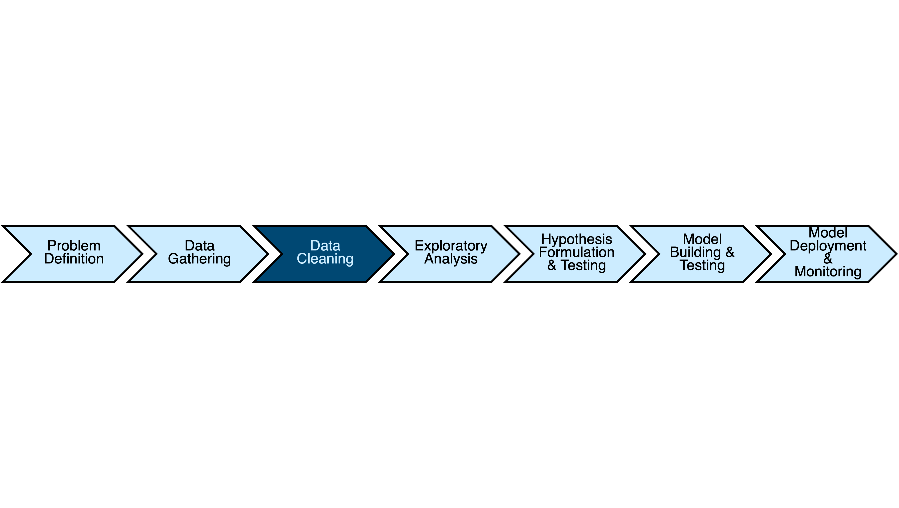

# Data Processing Workflow with Dask
## Cleaning and Transforming DataFrames




```python
# Before beginning, set your working directory to where the data resides
import os
os.chdir('nyc_parking_violations')
```

###  Read the datasets using our schema based on the data dictionary


```python
import dask.dataframe as dd
from dask.diagnostics import ProgressBar
import numpy as np

dtypes = {
 'Date First Observed': np.str_,
 'Days Parking In Effect    ': np.str_,
 'Double Parking Violation': np.str_,
 'Feet From Curb': np.float32,
 'From Hours In Effect': np.str_,
 'House Number': np.str_,
 'Hydrant Violation': np.str_,
 'Intersecting Street': np.str_,
 'Issue Date': np.str_,
 'Issuer Code': np.float32,
 'Issuer Command': np.str_,
 'Issuer Precinct': np.float32,
 'Issuer Squad': np.str_,
 'Issuing Agency': np.str_,
 'Law Section': np.float32,
 'Meter Number': np.str_,
 'No Standing or Stopping Violation': np.str_,
 'Plate ID': np.str_,
 'Plate Type': np.str_,
 'Registration State': np.str_,
 'Street Code1': np.uint32,
 'Street Code2': np.uint32,
 'Street Code3': np.uint32,
 'Street Name': np.str_,
 'Sub Division': np.str_,
 'Summons Number': np.uint32,
 'Time First Observed': np.str_,
 'To Hours In Effect': np.str_,
 'Unregistered Vehicle?': np.str_,
 'Vehicle Body Type': np.str_,
 'Vehicle Color': np.str_,
 'Vehicle Expiration Date': np.str_,
 'Vehicle Make': np.str_,
 'Vehicle Year': np.float32,
 'Violation Code': np.uint16,
 'Violation County': np.str_,
 'Violation Description': np.str_,
 'Violation In Front Of Or Opposite': np.str_,
 'Violation Legal Code': np.str_,
 'Violation Location': np.str_,
 'Violation Post Code': np.str_,
 'Violation Precinct': np.float32,
 'Violation Time': np.str_
}

nyc_data_raw = dd.read_csv('2014-2017/*.csv', dtype=dtypes, usecols=dtypes.keys())
```

### Selecting columns from a dataframe


```python
# Selecting a single column
with ProgressBar():
    display(nyc_data_raw['Plate ID'].head())
```

    [########################################] | 100% Completed |  1.1s


    0    GBB9093
    1    62416MB
    2    78755JZ
    3    63009MA
    4    91648MC
    Name: Plate ID, dtype: object


```python
# Selecting multiple columns from a dataframe using an inline list
with ProgressBar():
    display(nyc_data_raw[['Plate ID', 'Registration State']].head())
```

    [########################################] | 100% Completed |  1.0s


<div>
<table border="1" class="dataframe">
  <thead>
    <tr style="text-align: right;">
      <th></th>
      <th>Plate ID</th>
      <th>Registration State</th>
    </tr>
  </thead>
  <tbody>
    <tr>
      <th>0</th>
      <td>GBB9093</td>
      <td>NY</td>
    </tr>
    <tr>
      <th>1</th>
      <td>62416MB</td>
      <td>NY</td>
    </tr>
    <tr>
      <th>2</th>
      <td>78755JZ</td>
      <td>NY</td>
    </tr>
    <tr>
      <th>3</th>
      <td>63009MA</td>
      <td>NY</td>
    </tr>
    <tr>
      <th>4</th>
      <td>91648MC</td>
      <td>NY</td>
    </tr>
  </tbody>
</table>
</div>


```python
# Selecting multiple columns from a dataframe using an declared list
columns_to_select = ['Plate ID', 'Registration State']

with ProgressBar():
    display(nyc_data_raw[columns_to_select].head())
```

    [########################################] | 100% Completed |  1.0s


<table border="1" class="dataframe">
  <thead>
    <tr style="text-align: right;">
      <th></th>
      <th>Plate ID</th>
      <th>Registration State</th>
    </tr>
  </thead>
  <tbody>
    <tr>
      <th>0</th>
      <td>GBB9093</td>
      <td>NY</td>
    </tr>
    <tr>
      <th>1</th>
      <td>62416MB</td>
      <td>NY</td>
    </tr>
    <tr>
      <th>2</th>
      <td>78755JZ</td>
      <td>NY</td>
    </tr>
    <tr>
      <th>3</th>
      <td>63009MA</td>
      <td>NY</td>
    </tr>
    <tr>
      <th>4</th>
      <td>91648MC</td>
      <td>NY</td>
    </tr>
  </tbody>
</table>
</div>


### Dropping columns from a dataframe


```python
# dropping s single column
with ProgressBar():
    display(nyc_data_raw.drop('Violation Code', axis=1).head())
```

    [########################################] | 100% Completed |  1.1s


<div>
<table border="1" class="dataframe">
  <thead>
    <tr style="text-align: right;">
      <th></th>
      <th>Summons Number</th>
      <th>Plate ID</th>
      <th>Registration State</th>
      <th>Plate Type</th>
      <th>Issue Date</th>
      <th>Vehicle Body Type</th>
      <th>Vehicle Make</th>
      <th>Issuing Agency</th>
      <th>Street Code1</th>
      <th>Street Code2</th>
      <th>...</th>
      <th>Vehicle Color</th>
      <th>Unregistered Vehicle?</th>
      <th>Vehicle Year</th>
      <th>Meter Number</th>
      <th>Feet From Curb</th>
      <th>Violation Post Code</th>
      <th>Violation Description</th>
      <th>No Standing or Stopping Violation</th>
      <th>Hydrant Violation</th>
      <th>Double Parking Violation</th>
    </tr>
  </thead>
  <tbody>
    <tr>
      <th>0</th>
      <td>1283294138</td>
      <td>GBB9093</td>
      <td>NY</td>
      <td>PAS</td>
      <td>08/04/2013</td>
      <td>SUBN</td>
      <td>AUDI</td>
      <td>P</td>
      <td>37250</td>
      <td>13610</td>
      <td>...</td>
      <td>GY</td>
      <td>0</td>
      <td>2013.0</td>
      <td>-</td>
      <td>0.0</td>
      <td>NaN</td>
      <td>NaN</td>
      <td>NaN</td>
      <td>NaN</td>
      <td>NaN</td>
    </tr>
    <tr>
      <th>1</th>
      <td>1283294151</td>
      <td>62416MB</td>
      <td>NY</td>
      <td>COM</td>
      <td>08/04/2013</td>
      <td>VAN</td>
      <td>FORD</td>
      <td>P</td>
      <td>37290</td>
      <td>40404</td>
      <td>...</td>
      <td>WH</td>
      <td>0</td>
      <td>2012.0</td>
      <td>-</td>
      <td>0.0</td>
      <td>NaN</td>
      <td>NaN</td>
      <td>NaN</td>
      <td>NaN</td>
      <td>NaN</td>
    </tr>
    <tr>
      <th>2</th>
      <td>1283294163</td>
      <td>78755JZ</td>
      <td>NY</td>
      <td>COM</td>
      <td>08/05/2013</td>
      <td>P-U</td>
      <td>CHEVR</td>
      <td>P</td>
      <td>37030</td>
      <td>31190</td>
      <td>...</td>
      <td>NaN</td>
      <td>0</td>
      <td>0.0</td>
      <td>-</td>
      <td>0.0</td>
      <td>NaN</td>
      <td>NaN</td>
      <td>NaN</td>
      <td>NaN</td>
      <td>NaN</td>
    </tr>
    <tr>
      <th>3</th>
      <td>1283294175</td>
      <td>63009MA</td>
      <td>NY</td>
      <td>COM</td>
      <td>08/05/2013</td>
      <td>VAN</td>
      <td>FORD</td>
      <td>P</td>
      <td>37270</td>
      <td>11710</td>
      <td>...</td>
      <td>WH</td>
      <td>0</td>
      <td>2010.0</td>
      <td>-</td>
      <td>0.0</td>
      <td>NaN</td>
      <td>NaN</td>
      <td>NaN</td>
      <td>NaN</td>
      <td>NaN</td>
    </tr>
    <tr>
      <th>4</th>
      <td>1283294187</td>
      <td>91648MC</td>
      <td>NY</td>
      <td>COM</td>
      <td>08/08/2013</td>
      <td>TRLR</td>
      <td>GMC</td>
      <td>P</td>
      <td>37240</td>
      <td>12010</td>
      <td>...</td>
      <td>BR</td>
      <td>0</td>
      <td>2012.0</td>
      <td>-</td>
      <td>0.0</td>
      <td>NaN</td>
      <td>NaN</td>
      <td>NaN</td>
      <td>NaN</td>
      <td>NaN</td>
    </tr>
  </tbody>
</table>
<p>5 rows × 42 columns</p>
</div>


```python
# Dropping multiple columns from a dataframe
violationColumnNames = list(filter(lambda columnName: 'Violation' in columnName, nyc_data_raw.columns))

with ProgressBar():
    display(nyc_data_raw.drop(violationColumnNames, axis=1).head())
```

    [########################################] | 100% Completed |  1.0s


<div>
<table border="1" class="dataframe">
  <thead>
    <tr style="text-align: right;">
      <th></th>
      <th>Summons Number</th>
      <th>Plate ID</th>
      <th>Registration State</th>
      <th>Plate Type</th>
      <th>Issue Date</th>
      <th>Vehicle Body Type</th>
      <th>Vehicle Make</th>
      <th>Issuing Agency</th>
      <th>Street Code1</th>
      <th>Street Code2</th>
      <th>...</th>
      <th>Law Section</th>
      <th>Sub Division</th>
      <th>Days Parking In Effect</th>
      <th>From Hours In Effect</th>
      <th>To Hours In Effect</th>
      <th>Vehicle Color</th>
      <th>Unregistered Vehicle?</th>
      <th>Vehicle Year</th>
      <th>Meter Number</th>
      <th>Feet From Curb</th>
    </tr>
  </thead>
  <tbody>
    <tr>
      <th>0</th>
      <td>1283294138</td>
      <td>GBB9093</td>
      <td>NY</td>
      <td>PAS</td>
      <td>08/04/2013</td>
      <td>SUBN</td>
      <td>AUDI</td>
      <td>P</td>
      <td>37250</td>
      <td>13610</td>
      <td>...</td>
      <td>408.0</td>
      <td>F1</td>
      <td>BBBBBBB</td>
      <td>ALL</td>
      <td>ALL</td>
      <td>GY</td>
      <td>0</td>
      <td>2013.0</td>
      <td>-</td>
      <td>0.0</td>
    </tr>
    <tr>
      <th>1</th>
      <td>1283294151</td>
      <td>62416MB</td>
      <td>NY</td>
      <td>COM</td>
      <td>08/04/2013</td>
      <td>VAN</td>
      <td>FORD</td>
      <td>P</td>
      <td>37290</td>
      <td>40404</td>
      <td>...</td>
      <td>408.0</td>
      <td>C</td>
      <td>BBBBBBB</td>
      <td>ALL</td>
      <td>ALL</td>
      <td>WH</td>
      <td>0</td>
      <td>2012.0</td>
      <td>-</td>
      <td>0.0</td>
    </tr>
    <tr>
      <th>2</th>
      <td>1283294163</td>
      <td>78755JZ</td>
      <td>NY</td>
      <td>COM</td>
      <td>08/05/2013</td>
      <td>P-U</td>
      <td>CHEVR</td>
      <td>P</td>
      <td>37030</td>
      <td>31190</td>
      <td>...</td>
      <td>408.0</td>
      <td>F7</td>
      <td>BBBBBBB</td>
      <td>ALL</td>
      <td>ALL</td>
      <td>NaN</td>
      <td>0</td>
      <td>0.0</td>
      <td>-</td>
      <td>0.0</td>
    </tr>
    <tr>
      <th>3</th>
      <td>1283294175</td>
      <td>63009MA</td>
      <td>NY</td>
      <td>COM</td>
      <td>08/05/2013</td>
      <td>VAN</td>
      <td>FORD</td>
      <td>P</td>
      <td>37270</td>
      <td>11710</td>
      <td>...</td>
      <td>408.0</td>
      <td>F1</td>
      <td>BBBBBBB</td>
      <td>ALL</td>
      <td>ALL</td>
      <td>WH</td>
      <td>0</td>
      <td>2010.0</td>
      <td>-</td>
      <td>0.0</td>
    </tr>
    <tr>
      <th>4</th>
      <td>1283294187</td>
      <td>91648MC</td>
      <td>NY</td>
      <td>COM</td>
      <td>08/08/2013</td>
      <td>TRLR</td>
      <td>GMC</td>
      <td>P</td>
      <td>37240</td>
      <td>12010</td>
      <td>...</td>
      <td>408.0</td>
      <td>E1</td>
      <td>BBBBBBB</td>
      <td>ALL</td>
      <td>ALL</td>
      <td>BR</td>
      <td>0</td>
      <td>2012.0</td>
      <td>-</td>
      <td>0.0</td>
    </tr>
  </tbody>
</table>
<p>5 rows × 31 columns</p>
</div>


### Renaming a Column


```python
nyc_data_renamed = nyc_data_raw.rename(columns={'Plate ID':'License Plate'})
nyc_data_renamed
```


<div><strong>Dask DataFrame Structure:</strong></div>
<div>
<table border="1" class="dataframe">
  <thead>
    <tr style="text-align: right;">
      <th></th>
      <th>Summons Number</th>
      <th>License Plate</th>
      <th>Registration State</th>
      <th>Plate Type</th>
      <th>Issue Date</th>
      <th>Violation Code</th>
      <th>Vehicle Body Type</th>
      <th>Vehicle Make</th>
      <th>Issuing Agency</th>
      <th>Street Code1</th>
      <th>Street Code2</th>
      <th>Street Code3</th>
      <th>Vehicle Expiration Date</th>
      <th>Violation Location</th>
      <th>Violation Precinct</th>
      <th>Issuer Precinct</th>
      <th>Issuer Code</th>
      <th>Issuer Command</th>
      <th>Issuer Squad</th>
      <th>Violation Time</th>
      <th>Time First Observed</th>
      <th>Violation County</th>
      <th>Violation In Front Of Or Opposite</th>
      <th>House Number</th>
      <th>Street Name</th>
      <th>Intersecting Street</th>
      <th>Date First Observed</th>
      <th>Law Section</th>
      <th>Sub Division</th>
      <th>Violation Legal Code</th>
      <th>Days Parking In Effect</th>
      <th>From Hours In Effect</th>
      <th>To Hours In Effect</th>
      <th>Vehicle Color</th>
      <th>Unregistered Vehicle?</th>
      <th>Vehicle Year</th>
      <th>Meter Number</th>
      <th>Feet From Curb</th>
      <th>Violation Post Code</th>
      <th>Violation Description</th>
      <th>No Standing or Stopping Violation</th>
      <th>Hydrant Violation</th>
      <th>Double Parking Violation</th>
    </tr>
    <tr>
      <th>npartitions=142</th>
      <th></th>
      <th></th>
      <th></th>
      <th></th>
      <th></th>
      <th></th>
      <th></th>
      <th></th>
      <th></th>
      <th></th>
      <th></th>
      <th></th>
      <th></th>
      <th></th>
      <th></th>
      <th></th>
      <th></th>
      <th></th>
      <th></th>
      <th></th>
      <th></th>
      <th></th>
      <th></th>
      <th></th>
      <th></th>
      <th></th>
      <th></th>
      <th></th>
      <th></th>
      <th></th>
      <th></th>
      <th></th>
      <th></th>
      <th></th>
      <th></th>
      <th></th>
      <th></th>
      <th></th>
      <th></th>
      <th></th>
      <th></th>
      <th></th>
      <th></th>
    </tr>
  </thead>
  <tbody>
    <tr>
      <th></th>
      <td>uint32</td>
      <td>object</td>
      <td>object</td>
      <td>object</td>
      <td>object</td>
      <td>uint16</td>
      <td>object</td>
      <td>object</td>
      <td>object</td>
      <td>uint32</td>
      <td>uint32</td>
      <td>uint32</td>
      <td>object</td>
      <td>object</td>
      <td>float32</td>
      <td>float32</td>
      <td>float32</td>
      <td>object</td>
      <td>object</td>
      <td>object</td>
      <td>object</td>
      <td>object</td>
      <td>object</td>
      <td>object</td>
      <td>object</td>
      <td>object</td>
      <td>object</td>
      <td>float32</td>
      <td>object</td>
      <td>object</td>
      <td>object</td>
      <td>object</td>
      <td>object</td>
      <td>object</td>
      <td>object</td>
      <td>float32</td>
      <td>object</td>
      <td>float32</td>
      <td>object</td>
      <td>object</td>
      <td>object</td>
      <td>object</td>
      <td>object</td>
    </tr>
    <tr>
      <th></th>
      <td>...</td>
      <td>...</td>
      <td>...</td>
      <td>...</td>
      <td>...</td>
      <td>...</td>
      <td>...</td>
      <td>...</td>
      <td>...</td>
      <td>...</td>
      <td>...</td>
      <td>...</td>
      <td>...</td>
      <td>...</td>
      <td>...</td>
      <td>...</td>
      <td>...</td>
      <td>...</td>
      <td>...</td>
      <td>...</td>
      <td>...</td>
      <td>...</td>
      <td>...</td>
      <td>...</td>
      <td>...</td>
      <td>...</td>
      <td>...</td>
      <td>...</td>
      <td>...</td>
      <td>...</td>
      <td>...</td>
      <td>...</td>
      <td>...</td>
      <td>...</td>
      <td>...</td>
      <td>...</td>
      <td>...</td>
      <td>...</td>
      <td>...</td>
      <td>...</td>
      <td>...</td>
      <td>...</td>
      <td>...</td>
    </tr>
    <tr>
      <th>...</th>
      <td>...</td>
      <td>...</td>
      <td>...</td>
      <td>...</td>
      <td>...</td>
      <td>...</td>
      <td>...</td>
      <td>...</td>
      <td>...</td>
      <td>...</td>
      <td>...</td>
      <td>...</td>
      <td>...</td>
      <td>...</td>
      <td>...</td>
      <td>...</td>
      <td>...</td>
      <td>...</td>
      <td>...</td>
      <td>...</td>
      <td>...</td>
      <td>...</td>
      <td>...</td>
      <td>...</td>
      <td>...</td>
      <td>...</td>
      <td>...</td>
      <td>...</td>
      <td>...</td>
      <td>...</td>
      <td>...</td>
      <td>...</td>
      <td>...</td>
      <td>...</td>
      <td>...</td>
      <td>...</td>
      <td>...</td>
      <td>...</td>
      <td>...</td>
      <td>...</td>
      <td>...</td>
      <td>...</td>
      <td>...</td>
    </tr>
    <tr>
      <th></th>
      <td>...</td>
      <td>...</td>
      <td>...</td>
      <td>...</td>
      <td>...</td>
      <td>...</td>
      <td>...</td>
      <td>...</td>
      <td>...</td>
      <td>...</td>
      <td>...</td>
      <td>...</td>
      <td>...</td>
      <td>...</td>
      <td>...</td>
      <td>...</td>
      <td>...</td>
      <td>...</td>
      <td>...</td>
      <td>...</td>
      <td>...</td>
      <td>...</td>
      <td>...</td>
      <td>...</td>
      <td>...</td>
      <td>...</td>
      <td>...</td>
      <td>...</td>
      <td>...</td>
      <td>...</td>
      <td>...</td>
      <td>...</td>
      <td>...</td>
      <td>...</td>
      <td>...</td>
      <td>...</td>
      <td>...</td>
      <td>...</td>
      <td>...</td>
      <td>...</td>
      <td>...</td>
      <td>...</td>
      <td>...</td>
    </tr>
    <tr>
      <th></th>
      <td>...</td>
      <td>...</td>
      <td>...</td>
      <td>...</td>
      <td>...</td>
      <td>...</td>
      <td>...</td>
      <td>...</td>
      <td>...</td>
      <td>...</td>
      <td>...</td>
      <td>...</td>
      <td>...</td>
      <td>...</td>
      <td>...</td>
      <td>...</td>
      <td>...</td>
      <td>...</td>
      <td>...</td>
      <td>...</td>
      <td>...</td>
      <td>...</td>
      <td>...</td>
      <td>...</td>
      <td>...</td>
      <td>...</td>
      <td>...</td>
      <td>...</td>
      <td>...</td>
      <td>...</td>
      <td>...</td>
      <td>...</td>
      <td>...</td>
      <td>...</td>
      <td>...</td>
      <td>...</td>
      <td>...</td>
      <td>...</td>
      <td>...</td>
      <td>...</td>
      <td>...</td>
      <td>...</td>
      <td>...</td>
    </tr>
  </tbody>
</table>
</div>
<div>Dask Name: rename, 284 tasks</div>


### Selecting rows from a dataframe


```python
# Getting a single row by index
with ProgressBar():
    display(nyc_data_raw.loc[56].head(1))
```

    [########################################] | 100% Completed |  1.1s


<div>
<table border="1" class="dataframe">
  <thead>
    <tr style="text-align: right;">
      <th></th>
      <th>Summons Number</th>
      <th>Plate ID</th>
      <th>Registration State</th>
      <th>Plate Type</th>
      <th>Issue Date</th>
      <th>Violation Code</th>
      <th>Vehicle Body Type</th>
      <th>Vehicle Make</th>
      <th>Issuing Agency</th>
      <th>Street Code1</th>
      <th>...</th>
      <th>Vehicle Color</th>
      <th>Unregistered Vehicle?</th>
      <th>Vehicle Year</th>
      <th>Meter Number</th>
      <th>Feet From Curb</th>
      <th>Violation Post Code</th>
      <th>Violation Description</th>
      <th>No Standing or Stopping Violation</th>
      <th>Hydrant Violation</th>
      <th>Double Parking Violation</th>
    </tr>
  </thead>
  <tbody>
    <tr>
      <th>56</th>
      <td>1293090530</td>
      <td>GES3519</td>
      <td>NY</td>
      <td>PAS</td>
      <td>07/07/2013</td>
      <td>40</td>
      <td>SDN</td>
      <td>HONDA</td>
      <td>F</td>
      <td>70630</td>
      <td>...</td>
      <td>BLACK</td>
      <td>0</td>
      <td>1997.0</td>
      <td>-</td>
      <td>0.0</td>
      <td>NaN</td>
      <td>NaN</td>
      <td>NaN</td>
      <td>NaN</td>
      <td>NaN</td>
    </tr>
  </tbody>
</table>
<p>1 rows × 43 columns</p>
</div>


```python
# Getting a sequential slice of rows by index
with ProgressBar():
    display(nyc_data_raw.loc[100:200].head(100))
```

    [########################################] | 100% Completed |  1.0s


<div>
<table border="1" class="dataframe">
  <thead>
    <tr style="text-align: right;">
      <th></th>
      <th>Summons Number</th>
      <th>Plate ID</th>
      <th>Registration State</th>
      <th>Plate Type</th>
      <th>Issue Date</th>
      <th>Violation Code</th>
      <th>Vehicle Body Type</th>
      <th>Vehicle Make</th>
      <th>Issuing Agency</th>
      <th>Street Code1</th>
      <th>...</th>
      <th>Vehicle Color</th>
      <th>Unregistered Vehicle?</th>
      <th>Vehicle Year</th>
      <th>Meter Number</th>
      <th>Feet From Curb</th>
      <th>Violation Post Code</th>
      <th>Violation Description</th>
      <th>No Standing or Stopping Violation</th>
      <th>Hydrant Violation</th>
      <th>Double Parking Violation</th>
    </tr>
  </thead>
  <tbody>
    <tr>
      <th>100</th>
      <td>1294727205</td>
      <td>XBD7628</td>
      <td>VA</td>
      <td>PAS</td>
      <td>08/04/2013</td>
      <td>17</td>
      <td>SUBN</td>
      <td>JEEP</td>
      <td>P</td>
      <td>14510</td>
      <td>...</td>
      <td>GRY</td>
      <td>0</td>
      <td>0.0</td>
      <td>-</td>
      <td>0.0</td>
      <td>NaN</td>
      <td>NaN</td>
      <td>NaN</td>
      <td>NaN</td>
      <td>NaN</td>
    </tr>
    <tr>
      <th>101</th>
      <td>1294727461</td>
      <td>R613159</td>
      <td>IL</td>
      <td>PAS</td>
      <td>07/17/2013</td>
      <td>17</td>
      <td>SDN</td>
      <td>VOLKS</td>
      <td>P</td>
      <td>14510</td>
      <td>...</td>
      <td>BLUE</td>
      <td>0</td>
      <td>0.0</td>
      <td>-</td>
      <td>0.0</td>
      <td>NaN</td>
      <td>NaN</td>
      <td>NaN</td>
      <td>NaN</td>
      <td>NaN</td>
    </tr>
    <tr>
      <th>102</th>
      <td>1294727473</td>
      <td>6TCX735</td>
      <td>CA</td>
      <td>PAS</td>
      <td>07/18/2013</td>
      <td>17</td>
      <td>SDN</td>
      <td>MAZDA</td>
      <td>P</td>
      <td>14510</td>
      <td>...</td>
      <td>BLACK</td>
      <td>0</td>
      <td>0.0</td>
      <td>-</td>
      <td>0.0</td>
      <td>NaN</td>
      <td>NaN</td>
      <td>NaN</td>
      <td>NaN</td>
      <td>NaN</td>
    </tr>
    <tr>
      <th>103</th>
      <td>1294727497</td>
      <td>ZWZ43K</td>
      <td>NJ</td>
      <td>PAS</td>
      <td>08/10/2013</td>
      <td>17</td>
      <td>SUBN</td>
      <td>LINCO</td>
      <td>P</td>
      <td>14510</td>
      <td>...</td>
      <td>NaN</td>
      <td>0</td>
      <td>0.0</td>
      <td>-</td>
      <td>0.0</td>
      <td>NaN</td>
      <td>NaN</td>
      <td>NaN</td>
      <td>NaN</td>
      <td>NaN</td>
    </tr>
    <tr>
      <th>104</th>
      <td>1295357240</td>
      <td>T624858C</td>
      <td>NY</td>
      <td>PAS</td>
      <td>07/22/2013</td>
      <td>21</td>
      <td>SUBN</td>
      <td>TOYOT</td>
      <td>X</td>
      <td>28790</td>
      <td>...</td>
      <td>SILVE</td>
      <td>0</td>
      <td>2012.0</td>
      <td>-</td>
      <td>0.0</td>
      <td>NaN</td>
      <td>NaN</td>
      <td>NaN</td>
      <td>NaN</td>
      <td>NaN</td>
    </tr>
    <tr>
      <th>...</th>
      <td>...</td>
      <td>...</td>
      <td>...</td>
      <td>...</td>
      <td>...</td>
      <td>...</td>
      <td>...</td>
      <td>...</td>
      <td>...</td>
      <td>...</td>
      <td>...</td>
      <td>...</td>
      <td>...</td>
      <td>...</td>
      <td>...</td>
      <td>...</td>
      <td>...</td>
      <td>...</td>
      <td>...</td>
      <td>...</td>
      <td>...</td>
    </tr>
    <tr>
      <th>195</th>
      <td>1307953700</td>
      <td>481CKW</td>
      <td>NJ</td>
      <td>PAS</td>
      <td>07/27/2013</td>
      <td>24</td>
      <td>SUBN</td>
      <td>NISSA</td>
      <td>K</td>
      <td>0</td>
      <td>...</td>
      <td>PURPL</td>
      <td>0</td>
      <td>0.0</td>
      <td>-</td>
      <td>0.0</td>
      <td>NaN</td>
      <td>NaN</td>
      <td>NaN</td>
      <td>NaN</td>
      <td>NaN</td>
    </tr>
    <tr>
      <th>196</th>
      <td>1307953724</td>
      <td>W122KP</td>
      <td>NY</td>
      <td>PAS</td>
      <td>07/28/2013</td>
      <td>20</td>
      <td>SDN</td>
      <td>TOYOT</td>
      <td>K</td>
      <td>0</td>
      <td>...</td>
      <td>MAROO</td>
      <td>0</td>
      <td>1998.0</td>
      <td>-</td>
      <td>0.0</td>
      <td>NaN</td>
      <td>NaN</td>
      <td>NaN</td>
      <td>NaN</td>
      <td>NaN</td>
    </tr>
    <tr>
      <th>197</th>
      <td>1307953761</td>
      <td>GAW6458</td>
      <td>NY</td>
      <td>PAS</td>
      <td>08/17/2013</td>
      <td>20</td>
      <td>SDN</td>
      <td>TOYOT</td>
      <td>K</td>
      <td>48502</td>
      <td>...</td>
      <td>BLACK</td>
      <td>0</td>
      <td>2001.0</td>
      <td>-</td>
      <td>0.0</td>
      <td>NaN</td>
      <td>NaN</td>
      <td>NaN</td>
      <td>NaN</td>
      <td>NaN</td>
    </tr>
    <tr>
      <th>198</th>
      <td>1307953852</td>
      <td>GFP6251</td>
      <td>NY</td>
      <td>PAS</td>
      <td>08/24/2013</td>
      <td>27</td>
      <td>SDN</td>
      <td>NISSA</td>
      <td>K</td>
      <td>0</td>
      <td>...</td>
      <td>G/Y</td>
      <td>0</td>
      <td>2006.0</td>
      <td>-</td>
      <td>0.0</td>
      <td>NaN</td>
      <td>NaN</td>
      <td>NaN</td>
      <td>NaN</td>
      <td>NaN</td>
    </tr>
    <tr>
      <th>199</th>
      <td>1307953876</td>
      <td>JGV1886</td>
      <td>PA</td>
      <td>PAS</td>
      <td>08/11/2013</td>
      <td>20</td>
      <td>SUBN</td>
      <td>FORD</td>
      <td>K</td>
      <td>11220</td>
      <td>...</td>
      <td>GY</td>
      <td>0</td>
      <td>0.0</td>
      <td>-</td>
      <td>0.0</td>
      <td>NaN</td>
      <td>NaN</td>
      <td>NaN</td>
      <td>NaN</td>
      <td>NaN</td>
    </tr>
  </tbody>
</table>
<p>100 rows × 43 columns</p>
</div>


```python
# Filtering a slice of rows using Dask and Pandas
with ProgressBar():
    some_rows = nyc_data_raw.loc[100:200].head(100)
some_rows.drop(range(100, 200, 2))
```

    [########################################] | 100% Completed |  1.0s


<div>
<table border="1" class="dataframe">
  <thead>
    <tr style="text-align: right;">
      <th></th>
      <th>Summons Number</th>
      <th>Plate ID</th>
      <th>Registration State</th>
      <th>Plate Type</th>
      <th>Issue Date</th>
      <th>Violation Code</th>
      <th>Vehicle Body Type</th>
      <th>Vehicle Make</th>
      <th>Issuing Agency</th>
      <th>Street Code1</th>
      <th>...</th>
      <th>Vehicle Color</th>
      <th>Unregistered Vehicle?</th>
      <th>Vehicle Year</th>
      <th>Meter Number</th>
      <th>Feet From Curb</th>
      <th>Violation Post Code</th>
      <th>Violation Description</th>
      <th>No Standing or Stopping Violation</th>
      <th>Hydrant Violation</th>
      <th>Double Parking Violation</th>
    </tr>
  </thead>
  <tbody>
    <tr>
      <th>101</th>
      <td>1294727461</td>
      <td>R613159</td>
      <td>IL</td>
      <td>PAS</td>
      <td>07/17/2013</td>
      <td>17</td>
      <td>SDN</td>
      <td>VOLKS</td>
      <td>P</td>
      <td>14510</td>
      <td>...</td>
      <td>BLUE</td>
      <td>0</td>
      <td>0.0</td>
      <td>-</td>
      <td>0.0</td>
      <td>NaN</td>
      <td>NaN</td>
      <td>NaN</td>
      <td>NaN</td>
      <td>NaN</td>
    </tr>
    <tr>
      <th>103</th>
      <td>1294727497</td>
      <td>ZWZ43K</td>
      <td>NJ</td>
      <td>PAS</td>
      <td>08/10/2013</td>
      <td>17</td>
      <td>SUBN</td>
      <td>LINCO</td>
      <td>P</td>
      <td>14510</td>
      <td>...</td>
      <td>NaN</td>
      <td>0</td>
      <td>0.0</td>
      <td>-</td>
      <td>0.0</td>
      <td>NaN</td>
      <td>NaN</td>
      <td>NaN</td>
      <td>NaN</td>
      <td>NaN</td>
    </tr>
    <tr>
      <th>105</th>
      <td>1295546486</td>
      <td>42909JM</td>
      <td>NY</td>
      <td>COM</td>
      <td>07/17/2013</td>
      <td>19</td>
      <td>DELV</td>
      <td>MERCU</td>
      <td>P</td>
      <td>58590</td>
      <td>...</td>
      <td>BROWN</td>
      <td>0</td>
      <td>1996.0</td>
      <td>-</td>
      <td>0.0</td>
      <td>NaN</td>
      <td>NaN</td>
      <td>NaN</td>
      <td>NaN</td>
      <td>NaN</td>
    </tr>
    <tr>
      <th>107</th>
      <td>1302446484</td>
      <td>452WW4</td>
      <td>MA</td>
      <td>PAS</td>
      <td>06/24/2013</td>
      <td>46</td>
      <td>SDN</td>
      <td>CHEVR</td>
      <td>C</td>
      <td>75530</td>
      <td>...</td>
      <td>YELLO</td>
      <td>0</td>
      <td>2013.0</td>
      <td>-</td>
      <td>0.0</td>
      <td>NaN</td>
      <td>NaN</td>
      <td>NaN</td>
      <td>NaN</td>
      <td>NaN</td>
    </tr>
    <tr>
      <th>109</th>
      <td>1302453774</td>
      <td>GEX5296</td>
      <td>NY</td>
      <td>PAS</td>
      <td>07/26/2013</td>
      <td>14</td>
      <td>SDN</td>
      <td>ME/BE</td>
      <td>C</td>
      <td>36420</td>
      <td>...</td>
      <td>BLACK</td>
      <td>0</td>
      <td>0.0</td>
      <td>-</td>
      <td>0.0</td>
      <td>NaN</td>
      <td>NaN</td>
      <td>NaN</td>
      <td>NaN</td>
      <td>NaN</td>
    </tr>
    <tr>
      <th>111</th>
      <td>1302453798</td>
      <td>867ZFX</td>
      <td>CT</td>
      <td>PAS</td>
      <td>07/15/2013</td>
      <td>17</td>
      <td>SDN</td>
      <td>ACURA</td>
      <td>C</td>
      <td>0</td>
      <td>...</td>
      <td>WHITE</td>
      <td>0</td>
      <td>0.0</td>
      <td>-</td>
      <td>0.0</td>
      <td>NaN</td>
      <td>NaN</td>
      <td>NaN</td>
      <td>NaN</td>
      <td>NaN</td>
    </tr>
    <tr>
      <th>113</th>
      <td>1302456593</td>
      <td>GEZ1408</td>
      <td>NY</td>
      <td>PAS</td>
      <td>07/15/2013</td>
      <td>17</td>
      <td>SUBN</td>
      <td>HYUND</td>
      <td>X</td>
      <td>77730</td>
      <td>...</td>
      <td>BLK</td>
      <td>0</td>
      <td>2013.0</td>
      <td>-</td>
      <td>0.0</td>
      <td>NaN</td>
      <td>NaN</td>
      <td>NaN</td>
      <td>NaN</td>
      <td>NaN</td>
    </tr>
    <tr>
      <th>115</th>
      <td>1302456738</td>
      <td>UCSLIM</td>
      <td>NY</td>
      <td>PAS</td>
      <td>08/07/2013</td>
      <td>17</td>
      <td>SUBN</td>
      <td>FORD</td>
      <td>X</td>
      <td>77730</td>
      <td>...</td>
      <td>BLK</td>
      <td>0</td>
      <td>2003.0</td>
      <td>-</td>
      <td>0.0</td>
      <td>NaN</td>
      <td>NaN</td>
      <td>NaN</td>
      <td>NaN</td>
      <td>NaN</td>
    </tr>
    <tr>
      <th>117</th>
      <td>1302466203</td>
      <td>HPM2636</td>
      <td>PA</td>
      <td>PAS</td>
      <td>08/08/2013</td>
      <td>40</td>
      <td>SUBN</td>
      <td>CADIL</td>
      <td>X</td>
      <td>24245</td>
      <td>...</td>
      <td>SILVR</td>
      <td>0</td>
      <td>0.0</td>
      <td>-</td>
      <td>0.0</td>
      <td>NaN</td>
      <td>NaN</td>
      <td>NaN</td>
      <td>NaN</td>
      <td>NaN</td>
    </tr>
    <tr>
      <th>119</th>
      <td>1302466227</td>
      <td>TWODAMAX</td>
      <td>NY</td>
      <td>SRF</td>
      <td>08/05/2013</td>
      <td>17</td>
      <td>SDN</td>
      <td>HYUND</td>
      <td>X</td>
      <td>53630</td>
      <td>...</td>
      <td>GRAY</td>
      <td>0</td>
      <td>2012.0</td>
      <td>-</td>
      <td>0.0</td>
      <td>NaN</td>
      <td>NaN</td>
      <td>NaN</td>
      <td>NaN</td>
      <td>NaN</td>
    </tr>
    <tr>
      <th>121</th>
      <td>1302466318</td>
      <td>K39845</td>
      <td>NY</td>
      <td>PAS</td>
      <td>07/26/2013</td>
      <td>17</td>
      <td>SDN</td>
      <td>TOYOT</td>
      <td>X</td>
      <td>11700</td>
      <td>...</td>
      <td>BLUE</td>
      <td>0</td>
      <td>0.0</td>
      <td>-</td>
      <td>0.0</td>
      <td>NaN</td>
      <td>NaN</td>
      <td>NaN</td>
      <td>NaN</td>
      <td>NaN</td>
    </tr>
    <tr>
      <th>123</th>
      <td>1302466331</td>
      <td>GJA3150</td>
      <td>NY</td>
      <td>OMS</td>
      <td>07/12/2013</td>
      <td>40</td>
      <td>SDN</td>
      <td>CHEVR</td>
      <td>X</td>
      <td>53630</td>
      <td>...</td>
      <td>SILVR</td>
      <td>0</td>
      <td>2013.0</td>
      <td>-</td>
      <td>0.0</td>
      <td>NaN</td>
      <td>NaN</td>
      <td>NaN</td>
      <td>NaN</td>
      <td>NaN</td>
    </tr>
    <tr>
      <th>125</th>
      <td>1302466380</td>
      <td>GGS5125</td>
      <td>NY</td>
      <td>PAS</td>
      <td>07/09/2013</td>
      <td>17</td>
      <td>SDN</td>
      <td>VOLVO</td>
      <td>X</td>
      <td>53630</td>
      <td>...</td>
      <td>WHITE</td>
      <td>0</td>
      <td>2004.0</td>
      <td>-</td>
      <td>0.0</td>
      <td>NaN</td>
      <td>NaN</td>
      <td>NaN</td>
      <td>NaN</td>
      <td>NaN</td>
    </tr>
    <tr>
      <th>127</th>
      <td>1302466483</td>
      <td>GEF7281</td>
      <td>NY</td>
      <td>PAS</td>
      <td>06/28/2013</td>
      <td>17</td>
      <td>NaN</td>
      <td>HYUND</td>
      <td>X</td>
      <td>11800</td>
      <td>...</td>
      <td>BIRG</td>
      <td>0</td>
      <td>2006.0</td>
      <td>-</td>
      <td>0.0</td>
      <td>NaN</td>
      <td>NaN</td>
      <td>NaN</td>
      <td>NaN</td>
      <td>NaN</td>
    </tr>
    <tr>
      <th>129</th>
      <td>1302494843</td>
      <td>GHM9264</td>
      <td>NY</td>
      <td>PAS</td>
      <td>07/20/2013</td>
      <td>63</td>
      <td>SUBN</td>
      <td>ROVER</td>
      <td>X</td>
      <td>0</td>
      <td>...</td>
      <td>GY</td>
      <td>0</td>
      <td>2008.0</td>
      <td>-</td>
      <td>0.0</td>
      <td>NaN</td>
      <td>NaN</td>
      <td>NaN</td>
      <td>NaN</td>
      <td>NaN</td>
    </tr>
    <tr>
      <th>131</th>
      <td>1302494867</td>
      <td>W36CKK</td>
      <td>NJ</td>
      <td>PAS</td>
      <td>07/20/2013</td>
      <td>63</td>
      <td>SDN</td>
      <td>NISSA</td>
      <td>X</td>
      <td>0</td>
      <td>...</td>
      <td>BK</td>
      <td>0</td>
      <td>0.0</td>
      <td>-</td>
      <td>0.0</td>
      <td>NaN</td>
      <td>NaN</td>
      <td>NaN</td>
      <td>NaN</td>
      <td>NaN</td>
    </tr>
    <tr>
      <th>133</th>
      <td>1302494934</td>
      <td>GJA3298</td>
      <td>NY</td>
      <td>OMS</td>
      <td>07/19/2013</td>
      <td>63</td>
      <td>SDN</td>
      <td>NISSA</td>
      <td>X</td>
      <td>0</td>
      <td>...</td>
      <td>GY</td>
      <td>0</td>
      <td>2013.0</td>
      <td>-</td>
      <td>0.0</td>
      <td>NaN</td>
      <td>NaN</td>
      <td>NaN</td>
      <td>NaN</td>
      <td>NaN</td>
    </tr>
    <tr>
      <th>135</th>
      <td>1302494983</td>
      <td>RPH78</td>
      <td>NY</td>
      <td>SRF</td>
      <td>07/19/2013</td>
      <td>63</td>
      <td>SDN</td>
      <td>TOYOT</td>
      <td>X</td>
      <td>0</td>
      <td>...</td>
      <td>BEIGE</td>
      <td>0</td>
      <td>2005.0</td>
      <td>-</td>
      <td>0.0</td>
      <td>NaN</td>
      <td>NaN</td>
      <td>NaN</td>
      <td>NaN</td>
      <td>NaN</td>
    </tr>
    <tr>
      <th>137</th>
      <td>1302501653</td>
      <td>GDE3096</td>
      <td>NY</td>
      <td>PAS</td>
      <td>07/24/2013</td>
      <td>24</td>
      <td>FOUR</td>
      <td>ME/BE</td>
      <td>X</td>
      <td>0</td>
      <td>...</td>
      <td>WHITE</td>
      <td>0</td>
      <td>1990.0</td>
      <td>-</td>
      <td>0.0</td>
      <td>NaN</td>
      <td>NaN</td>
      <td>NaN</td>
      <td>NaN</td>
      <td>NaN</td>
    </tr>
    <tr>
      <th>139</th>
      <td>1302511257</td>
      <td>GFP5637</td>
      <td>NY</td>
      <td>PAS</td>
      <td>07/18/2013</td>
      <td>20</td>
      <td>SUBN</td>
      <td>TOYOT</td>
      <td>X</td>
      <td>0</td>
      <td>...</td>
      <td>GRAY</td>
      <td>0</td>
      <td>2012.0</td>
      <td>-</td>
      <td>0.0</td>
      <td>NaN</td>
      <td>NaN</td>
      <td>NaN</td>
      <td>NaN</td>
      <td>NaN</td>
    </tr>
    <tr>
      <th>141</th>
      <td>1302513254</td>
      <td>GEF7457</td>
      <td>NY</td>
      <td>PAS</td>
      <td>07/21/2013</td>
      <td>20</td>
      <td>SDN</td>
      <td>PONTI</td>
      <td>X</td>
      <td>0</td>
      <td>...</td>
      <td>WHITE</td>
      <td>0</td>
      <td>1995.0</td>
      <td>-</td>
      <td>0.0</td>
      <td>NaN</td>
      <td>NaN</td>
      <td>NaN</td>
      <td>NaN</td>
      <td>NaN</td>
    </tr>
    <tr>
      <th>143</th>
      <td>1302870749</td>
      <td>96272JY</td>
      <td>NY</td>
      <td>COM</td>
      <td>08/02/2013</td>
      <td>14</td>
      <td>DELV</td>
      <td>MITSU</td>
      <td>T</td>
      <td>18250</td>
      <td>...</td>
      <td>WH</td>
      <td>0</td>
      <td>2005.0</td>
      <td>-</td>
      <td>0.0</td>
      <td>NaN</td>
      <td>NaN</td>
      <td>NaN</td>
      <td>NaN</td>
      <td>NaN</td>
    </tr>
    <tr>
      <th>145</th>
      <td>1305400720</td>
      <td>STN2382</td>
      <td>NC</td>
      <td>PAS</td>
      <td>08/03/2013</td>
      <td>40</td>
      <td>SUBN</td>
      <td>NISSA</td>
      <td>P</td>
      <td>0</td>
      <td>...</td>
      <td>GRAY</td>
      <td>0</td>
      <td>2004.0</td>
      <td>-</td>
      <td>0.0</td>
      <td>NaN</td>
      <td>NaN</td>
      <td>NaN</td>
      <td>NaN</td>
      <td>NaN</td>
    </tr>
    <tr>
      <th>147</th>
      <td>1306114172</td>
      <td>91628MC</td>
      <td>NY</td>
      <td>COM</td>
      <td>08/02/2013</td>
      <td>46</td>
      <td>REFG</td>
      <td>HINO</td>
      <td>P</td>
      <td>36490</td>
      <td>...</td>
      <td>WH</td>
      <td>0</td>
      <td>2007.0</td>
      <td>-</td>
      <td>0.0</td>
      <td>NaN</td>
      <td>NaN</td>
      <td>NaN</td>
      <td>NaN</td>
      <td>NaN</td>
    </tr>
    <tr>
      <th>149</th>
      <td>1306114196</td>
      <td>62092JL</td>
      <td>NY</td>
      <td>COM</td>
      <td>08/23/2013</td>
      <td>46</td>
      <td>REFG</td>
      <td>ISUZU</td>
      <td>P</td>
      <td>0</td>
      <td>...</td>
      <td>OR</td>
      <td>0</td>
      <td>2011.0</td>
      <td>-</td>
      <td>0.0</td>
      <td>NaN</td>
      <td>NaN</td>
      <td>NaN</td>
      <td>NaN</td>
      <td>NaN</td>
    </tr>
    <tr>
      <th>151</th>
      <td>1306206844</td>
      <td>55197JJ</td>
      <td>NY</td>
      <td>COM</td>
      <td>08/06/2013</td>
      <td>46</td>
      <td>DELV</td>
      <td>NaN</td>
      <td>P</td>
      <td>13110</td>
      <td>...</td>
      <td>W</td>
      <td>0</td>
      <td>2001.0</td>
      <td>-</td>
      <td>0.0</td>
      <td>NaN</td>
      <td>NaN</td>
      <td>NaN</td>
      <td>NaN</td>
      <td>NaN</td>
    </tr>
    <tr>
      <th>153</th>
      <td>1306632572</td>
      <td>45940MD</td>
      <td>NY</td>
      <td>COM</td>
      <td>08/01/2013</td>
      <td>78</td>
      <td>VAN</td>
      <td>FORD</td>
      <td>P</td>
      <td>44240</td>
      <td>...</td>
      <td>WHT</td>
      <td>0</td>
      <td>2013.0</td>
      <td>-</td>
      <td>0.0</td>
      <td>NaN</td>
      <td>NaN</td>
      <td>NaN</td>
      <td>NaN</td>
      <td>NaN</td>
    </tr>
    <tr>
      <th>155</th>
      <td>1306755700</td>
      <td>Y309CZ</td>
      <td>NY</td>
      <td>PAS</td>
      <td>08/02/2013</td>
      <td>21</td>
      <td>SUBN</td>
      <td>NaN</td>
      <td>S</td>
      <td>52490</td>
      <td>...</td>
      <td>GRAY</td>
      <td>0</td>
      <td>2013.0</td>
      <td>-</td>
      <td>0.0</td>
      <td>NaN</td>
      <td>NaN</td>
      <td>NaN</td>
      <td>NaN</td>
      <td>NaN</td>
    </tr>
    <tr>
      <th>157</th>
      <td>1306757629</td>
      <td>561CVB</td>
      <td>NJ</td>
      <td>PAS</td>
      <td>08/06/2013</td>
      <td>21</td>
      <td>SUBN</td>
      <td>BMW</td>
      <td>S</td>
      <td>45990</td>
      <td>...</td>
      <td>SIL</td>
      <td>0</td>
      <td>0.0</td>
      <td>-</td>
      <td>0.0</td>
      <td>NaN</td>
      <td>NaN</td>
      <td>NaN</td>
      <td>NaN</td>
      <td>NaN</td>
    </tr>
    <tr>
      <th>159</th>
      <td>1306757861</td>
      <td>5CA14E</td>
      <td>MI</td>
      <td>PAS</td>
      <td>08/02/2013</td>
      <td>21</td>
      <td>SDN</td>
      <td>HONDA</td>
      <td>S</td>
      <td>53190</td>
      <td>...</td>
      <td>GREEN</td>
      <td>0</td>
      <td>0.0</td>
      <td>-</td>
      <td>0.0</td>
      <td>NaN</td>
      <td>NaN</td>
      <td>NaN</td>
      <td>NaN</td>
      <td>NaN</td>
    </tr>
    <tr>
      <th>161</th>
      <td>1306759249</td>
      <td>GEK4279</td>
      <td>NY</td>
      <td>PAS</td>
      <td>08/02/2013</td>
      <td>21</td>
      <td>SDN</td>
      <td>BMW</td>
      <td>S</td>
      <td>23180</td>
      <td>...</td>
      <td>BLACK</td>
      <td>0</td>
      <td>2002.0</td>
      <td>-</td>
      <td>0.0</td>
      <td>NaN</td>
      <td>NaN</td>
      <td>NaN</td>
      <td>NaN</td>
      <td>NaN</td>
    </tr>
    <tr>
      <th>163</th>
      <td>1306759262</td>
      <td>GDL7143</td>
      <td>NY</td>
      <td>PAS</td>
      <td>08/16/2013</td>
      <td>21</td>
      <td>SDN</td>
      <td>BMW</td>
      <td>S</td>
      <td>23180</td>
      <td>...</td>
      <td>WHT</td>
      <td>0</td>
      <td>2013.0</td>
      <td>-</td>
      <td>0.0</td>
      <td>NaN</td>
      <td>NaN</td>
      <td>NaN</td>
      <td>NaN</td>
      <td>NaN</td>
    </tr>
    <tr>
      <th>165</th>
      <td>1306759432</td>
      <td>JLE4572</td>
      <td>PA</td>
      <td>PAS</td>
      <td>07/23/2013</td>
      <td>21</td>
      <td>SDN</td>
      <td>NISSA</td>
      <td>S</td>
      <td>24540</td>
      <td>...</td>
      <td>BLK</td>
      <td>0</td>
      <td>0.0</td>
      <td>-</td>
      <td>0.0</td>
      <td>NaN</td>
      <td>NaN</td>
      <td>NaN</td>
      <td>NaN</td>
      <td>NaN</td>
    </tr>
    <tr>
      <th>167</th>
      <td>1306759481</td>
      <td>HSW7971</td>
      <td>PA</td>
      <td>PAS</td>
      <td>07/24/2013</td>
      <td>21</td>
      <td>SUBN</td>
      <td>MAZDA</td>
      <td>S</td>
      <td>24040</td>
      <td>...</td>
      <td>BLK</td>
      <td>0</td>
      <td>2012.0</td>
      <td>-</td>
      <td>0.0</td>
      <td>NaN</td>
      <td>NaN</td>
      <td>NaN</td>
      <td>NaN</td>
      <td>NaN</td>
    </tr>
    <tr>
      <th>169</th>
      <td>1306771572</td>
      <td>WUV6389</td>
      <td>VA</td>
      <td>PAS</td>
      <td>08/19/2013</td>
      <td>21</td>
      <td>SUBN</td>
      <td>GMC</td>
      <td>S</td>
      <td>12330</td>
      <td>...</td>
      <td>WHITE</td>
      <td>0</td>
      <td>0.0</td>
      <td>-</td>
      <td>0.0</td>
      <td>NaN</td>
      <td>NaN</td>
      <td>NaN</td>
      <td>NaN</td>
      <td>NaN</td>
    </tr>
    <tr>
      <th>171</th>
      <td>1306771596</td>
      <td>GFF5181</td>
      <td>NY</td>
      <td>PAS</td>
      <td>08/19/2013</td>
      <td>21</td>
      <td>SUBN</td>
      <td>CHEVR</td>
      <td>S</td>
      <td>12330</td>
      <td>...</td>
      <td>BLUE</td>
      <td>0</td>
      <td>2004.0</td>
      <td>-</td>
      <td>0.0</td>
      <td>NaN</td>
      <td>NaN</td>
      <td>NaN</td>
      <td>NaN</td>
      <td>NaN</td>
    </tr>
    <tr>
      <th>173</th>
      <td>1306775462</td>
      <td>P47914</td>
      <td>MA</td>
      <td>COM</td>
      <td>07/29/2013</td>
      <td>40</td>
      <td>VAN</td>
      <td>FORD</td>
      <td>S</td>
      <td>29890</td>
      <td>...</td>
      <td>TAN</td>
      <td>0</td>
      <td>0.0</td>
      <td>-</td>
      <td>0.0</td>
      <td>NaN</td>
      <td>NaN</td>
      <td>NaN</td>
      <td>NaN</td>
      <td>NaN</td>
    </tr>
    <tr>
      <th>175</th>
      <td>1307045133</td>
      <td>GFC8953</td>
      <td>NY</td>
      <td>PAS</td>
      <td>07/26/2013</td>
      <td>20</td>
      <td>SDN</td>
      <td>HONDA</td>
      <td>P</td>
      <td>61030</td>
      <td>...</td>
      <td>BK</td>
      <td>0</td>
      <td>1997.0</td>
      <td>-</td>
      <td>0.0</td>
      <td>NaN</td>
      <td>NaN</td>
      <td>NaN</td>
      <td>NaN</td>
      <td>NaN</td>
    </tr>
    <tr>
      <th>177</th>
      <td>1307238828</td>
      <td>GEX4415</td>
      <td>NY</td>
      <td>PAS</td>
      <td>08/18/2013</td>
      <td>14</td>
      <td>SDN</td>
      <td>HONDA</td>
      <td>P</td>
      <td>65120</td>
      <td>...</td>
      <td>BLK</td>
      <td>0</td>
      <td>2004.0</td>
      <td>-</td>
      <td>0.0</td>
      <td>NaN</td>
      <td>NaN</td>
      <td>NaN</td>
      <td>NaN</td>
      <td>NaN</td>
    </tr>
    <tr>
      <th>179</th>
      <td>1307452577</td>
      <td>55003JG</td>
      <td>NY</td>
      <td>COM</td>
      <td>08/12/2013</td>
      <td>46</td>
      <td>DELV</td>
      <td>WORKV</td>
      <td>P</td>
      <td>10010</td>
      <td>...</td>
      <td>WHITE</td>
      <td>0</td>
      <td>1999.0</td>
      <td>-</td>
      <td>0.0</td>
      <td>NaN</td>
      <td>NaN</td>
      <td>NaN</td>
      <td>NaN</td>
      <td>NaN</td>
    </tr>
    <tr>
      <th>181</th>
      <td>1307452590</td>
      <td>40470JU</td>
      <td>99</td>
      <td>COM</td>
      <td>08/12/2013</td>
      <td>46</td>
      <td>DELV</td>
      <td>MERCU</td>
      <td>P</td>
      <td>10110</td>
      <td>...</td>
      <td>WHITE</td>
      <td>0</td>
      <td>2004.0</td>
      <td>-</td>
      <td>0.0</td>
      <td>NaN</td>
      <td>NaN</td>
      <td>NaN</td>
      <td>NaN</td>
      <td>NaN</td>
    </tr>
    <tr>
      <th>183</th>
      <td>1307846646</td>
      <td>7L6A</td>
      <td>NY</td>
      <td>SRF</td>
      <td>08/14/2013</td>
      <td>14</td>
      <td>TAXI</td>
      <td>TOYOT</td>
      <td>P</td>
      <td>36210</td>
      <td>...</td>
      <td>YELLO</td>
      <td>0</td>
      <td>2010.0</td>
      <td>-</td>
      <td>0.0</td>
      <td>NaN</td>
      <td>NaN</td>
      <td>NaN</td>
      <td>NaN</td>
      <td>NaN</td>
    </tr>
    <tr>
      <th>185</th>
      <td>1307935217</td>
      <td>H50DHM</td>
      <td>NJ</td>
      <td>PAS</td>
      <td>07/30/2013</td>
      <td>40</td>
      <td>SDN</td>
      <td>MITSU</td>
      <td>K</td>
      <td>45210</td>
      <td>...</td>
      <td>GREEN</td>
      <td>0</td>
      <td>0.0</td>
      <td>-</td>
      <td>5.0</td>
      <td>NaN</td>
      <td>NaN</td>
      <td>NaN</td>
      <td>NaN</td>
      <td>NaN</td>
    </tr>
    <tr>
      <th>187</th>
      <td>1307952574</td>
      <td>UDV99Y</td>
      <td>NJ</td>
      <td>PAS</td>
      <td>07/21/2013</td>
      <td>20</td>
      <td>SDN</td>
      <td>CHEVR</td>
      <td>K</td>
      <td>0</td>
      <td>...</td>
      <td>BLUE</td>
      <td>0</td>
      <td>0.0</td>
      <td>-</td>
      <td>0.0</td>
      <td>NaN</td>
      <td>NaN</td>
      <td>NaN</td>
      <td>NaN</td>
      <td>NaN</td>
    </tr>
    <tr>
      <th>189</th>
      <td>1307952987</td>
      <td>GGW8417</td>
      <td>NY</td>
      <td>PAS</td>
      <td>07/21/2013</td>
      <td>63</td>
      <td>SUBN</td>
      <td>JEEP</td>
      <td>K</td>
      <td>0</td>
      <td>...</td>
      <td>BLACK</td>
      <td>0</td>
      <td>2003.0</td>
      <td>-</td>
      <td>0.0</td>
      <td>NaN</td>
      <td>NaN</td>
      <td>NaN</td>
      <td>NaN</td>
      <td>NaN</td>
    </tr>
    <tr>
      <th>191</th>
      <td>1307953128</td>
      <td>N34ASW</td>
      <td>NJ</td>
      <td>PAS</td>
      <td>08/11/2013</td>
      <td>61</td>
      <td>SDN</td>
      <td>CHEVR</td>
      <td>K</td>
      <td>0</td>
      <td>...</td>
      <td>BL</td>
      <td>0</td>
      <td>0.0</td>
      <td>-</td>
      <td>0.0</td>
      <td>NaN</td>
      <td>NaN</td>
      <td>NaN</td>
      <td>NaN</td>
      <td>NaN</td>
    </tr>
    <tr>
      <th>193</th>
      <td>1307953682</td>
      <td>GGS6051</td>
      <td>NY</td>
      <td>PAS</td>
      <td>07/27/2013</td>
      <td>24</td>
      <td>SDN</td>
      <td>NISSA</td>
      <td>K</td>
      <td>0</td>
      <td>...</td>
      <td>BLUE</td>
      <td>0</td>
      <td>2008.0</td>
      <td>-</td>
      <td>0.0</td>
      <td>NaN</td>
      <td>NaN</td>
      <td>NaN</td>
      <td>NaN</td>
      <td>NaN</td>
    </tr>
    <tr>
      <th>195</th>
      <td>1307953700</td>
      <td>481CKW</td>
      <td>NJ</td>
      <td>PAS</td>
      <td>07/27/2013</td>
      <td>24</td>
      <td>SUBN</td>
      <td>NISSA</td>
      <td>K</td>
      <td>0</td>
      <td>...</td>
      <td>PURPL</td>
      <td>0</td>
      <td>0.0</td>
      <td>-</td>
      <td>0.0</td>
      <td>NaN</td>
      <td>NaN</td>
      <td>NaN</td>
      <td>NaN</td>
      <td>NaN</td>
    </tr>
    <tr>
      <th>197</th>
      <td>1307953761</td>
      <td>GAW6458</td>
      <td>NY</td>
      <td>PAS</td>
      <td>08/17/2013</td>
      <td>20</td>
      <td>SDN</td>
      <td>TOYOT</td>
      <td>K</td>
      <td>48502</td>
      <td>...</td>
      <td>BLACK</td>
      <td>0</td>
      <td>2001.0</td>
      <td>-</td>
      <td>0.0</td>
      <td>NaN</td>
      <td>NaN</td>
      <td>NaN</td>
      <td>NaN</td>
      <td>NaN</td>
    </tr>
    <tr>
      <th>199</th>
      <td>1307953876</td>
      <td>JGV1886</td>
      <td>PA</td>
      <td>PAS</td>
      <td>08/11/2013</td>
      <td>20</td>
      <td>SUBN</td>
      <td>FORD</td>
      <td>K</td>
      <td>11220</td>
      <td>...</td>
      <td>GY</td>
      <td>0</td>
      <td>0.0</td>
      <td>-</td>
      <td>0.0</td>
      <td>NaN</td>
      <td>NaN</td>
      <td>NaN</td>
      <td>NaN</td>
      <td>NaN</td>
    </tr>
  </tbody>
</table>
<p>50 rows × 43 columns</p>
</div>


### Counting Missing Values in a Dataframe


```python
# Calculating the percentage of missing values by column
missing_values = nyc_data_raw.isnull().sum()
with ProgressBar():
    percent_missing = ((missing_values / nyc_data_raw.index.size) * 100).compute()
percent_missing
```

    [########################################] | 100% Completed |  2min 36.3s


    Summons Number                        0.000000
    Plate ID                              0.020867
    Registration State                    0.000000
    Plate Type                            0.000000
    Issue Date                            0.000000
    Violation Code                        0.000000
    Vehicle Body Type                     0.564922
    Vehicle Make                          0.650526
    Issuing Agency                        0.000000
    Street Code1                          0.000000
    Street Code2                          0.000000
    Street Code3                          0.000000
    Vehicle Expiration Date               0.000002
    Violation Location                   15.142846
    Violation Precinct                    0.000002
    Issuer Precinct                       0.000002
    Issuer Code                           0.000002
    Issuer Command                       15.018851
    Issuer Squad                         15.022566
    Violation Time                        0.019207
    Time First Observed                  90.040886
    Violation County                     10.154892
    Violation In Front Of Or Opposite    15.953282
    House Number                         16.932473
    Street Name                           0.054894
    Intersecting Street                  72.571941
    Date First Observed                   0.000007
    Law Section                           0.000007
    Sub Division                          0.012412
    Violation Legal Code                 84.970398
    Days Parking In Effect               23.225424
    From Hours In Effect                 44.821011
    To Hours In Effect                   44.821004
    Vehicle Color                         1.152299
    Unregistered Vehicle?                88.484122
    Vehicle Year                          0.000012
    Meter Number                         81.115883
    Feet From Curb                        0.000012
    Violation Post Code                  26.532350
    Violation Description                11.523098
    No Standing or Stopping Violation    99.999998
    Hydrant Violation                    99.999998
    Double Parking Violation             99.999998
    dtype: float64


### Dropping columns with missing values


```python
# Dropping columns that have more than 50% (>=50%) missing values
columns_to_drop = list(percent_missing[percent_missing >= 50].index)
nyc_data_clean_stage1 = nyc_data_raw.drop(columns_to_drop, axis=1)
```

### Imputing Missing Values


```python
# Imputing missing values
with ProgressBar():
    count_of_vehicle_colors = nyc_data_clean_stage1['Vehicle Color'].value_counts().compute()
most_common_color = count_of_vehicle_colors.sort_values(ascending=False).index[0]

# Fill missing vehicle color with the most common color
nyc_data_clean_stage2 = nyc_data_clean_stage1.fillna({'Vehicle Color': most_common_color})
```

    [########################################] | 100% Completed |  1min 46.6s


### Dropping rows with missing Data


```python
# Updated to compensate for bug identified in https://github.com/dask/dask/issues/5854

# Old code:
# rows_to_drop = list(percent_missing[(percent_missing > 0) & (percent_missing < 5)].index)
# nyc_data_clean_stage3 = nyc_data_clean_stage2.dropna(subset=rows_to_drop)

# New code splits the rows to drop into two separate lists and chains the dropna methods to drop all the columns we want
rows_to_drop1 =['Plate ID', 'Vehicle Body Type', 'Vehicle Make', 'Vehicle Expiration Date', 'Violation Precinct', 'Issuer Precinct', 'Issuer Code', 'Violation Time', 'Street Name']
rows_to_drop2 =['Date First Observed', 'Law Section', 'Sub Division', 'Vehicle Color', 'Vehicle Year', 'Feet From Curb']
nyc_data_clean_stage3 = nyc_data_clean_stage2.dropna(subset=rows_to_drop1).dropna(subset=rows_to_drop2)
```

### Imputing Multiple Columns with Missing Values


```python
# Finding the datatypes of the remaining Columns
remaining_columns_to_clean = list(percent_missing[(percent_missing >= 5) & (percent_missing < 50)].index)
nyc_data_raw.dtypes[remaining_columns_to_clean]
```


    Violation Location                   object
    Issuer Command                       object
    Issuer Squad                         object
    Violation County                     object
    Violation In Front Of Or Opposite    object
    House Number                         object
    Days Parking In Effect               object
    From Hours In Effect                 object
    To Hours In Effect                   object
    Violation Post Code                  object
    Violation Description                object
    dtype: object


```python
# Making a dictionary of values for fillna
unknown_default_dict = dict(map(lambda columnName: (columnName, 'Unknown'), remaining_columns_to_clean))
```


```python
# Filling the dataframe with default values
nyc_data_clean_stage4 = nyc_data_clean_stage3.fillna(unknown_default_dict)
```


```python
# Checking the success of the filling/dropping operations
with ProgressBar():
    print(nyc_data_clean_stage4.isnull().sum().compute())
    nyc_data_clean_stage4.persist()
```

    [########################################] | 100% Completed |  3min  9.4s
    Summons Number                       0
    Plate ID                             0
    Registration State                   0
    Plate Type                           0
    Issue Date                           0
    Violation Code                       0
    Vehicle Body Type                    0
    Vehicle Make                         0
    Issuing Agency                       0
    Street Code1                         0
    Street Code2                         0
    Street Code3                         0
    Vehicle Expiration Date              0
    Violation Location                   0
    Violation Precinct                   0
    Issuer Precinct                      0
    Issuer Code                          0
    Issuer Command                       0
    Issuer Squad                         0
    Violation Time                       0
    Violation County                     0
    Violation In Front Of Or Opposite    0
    House Number                         0
    Street Name                          0
    Date First Observed                  0
    Law Section                          0
    Sub Division                         0
    Days Parking In Effect               0
    From Hours In Effect                 0
    To Hours In Effect                   0
    Vehicle Color                        0
    Vehicle Year                         0
    Feet From Curb                       0
    Violation Post Code                  0
    Violation Description                0
    dtype: int64
    [########################################] | 100% Completed |  2min 32.7s


### Recoding data


```python
# Getting value count of the plate type column
with ProgressBar():
    license_plate_types = nyc_data_clean_stage4['Plate Type'].value_counts().compute()
license_plate_types
```

    [########################################] | 100% Completed |  2min 45.4s


    PAS    30452502
    COM     7966914
    OMT     1389341
    SRF      394656
    OMS      368952
             ...   
    HOU           4
    JWV           3
    LOC           3
    HIF           2
    SNO           2
    Name: Plate Type, Length: 90, dtype: int64


```python
# Recoding the Plate Type column
condition = nyc_data_clean_stage4['Plate Type'].isin(['PAS', 'COM'])
plate_type_masked = nyc_data_clean_stage4['Plate Type'].where(condition, 'Other')
nyc_data_recode_stage1 = nyc_data_clean_stage4.drop('Plate Type', axis=1)
nyc_data_recode_stage2 = nyc_data_recode_stage1.assign(PlateType=plate_type_masked)
nyc_data_recode_stage3 = nyc_data_recode_stage2.rename(columns={'PlateType':'Plate Type'})
```


```python
# Looking at the value counts after recoding
with ProgressBar():
    display(nyc_data_recode_stage3['Plate Type'].value_counts().compute())
```

    [########################################] | 100% Completed |  3min  1.7s


    PAS      30452502
    COM       7966914
    Other     3418586
    Name: Plate Type, dtype: int64


```python
# Using mask to put unique colors in an “Other” category
single_color = list(count_of_vehicle_colors[count_of_vehicle_colors == 1].index)
condition = nyc_data_clean_stage4['Vehicle Color'].isin(single_color)
vehicle_color_masked = nyc_data_clean_stage4['Vehicle Color'].mask(condition, 'Other')
nyc_data_recode_stage4 = nyc_data_recode_stage3.drop('Vehicle Color', axis=1)
nyc_data_recode_stage5 = nyc_data_recode_stage4.assign(VehicleColor=vehicle_color_masked)
nyc_data_recode_stage6 = nyc_data_recode_stage5.rename(columns={'VehicleColor':'Vehicle Color'})
```

### Elementwise operations


```python
# Parsing the issue date column
from datetime import datetime
issue_date_parsed = nyc_data_recode_stage6['Issue Date'].apply(lambda x: datetime.strptime(x, "%m/%d/%Y"), meta=datetime)
nyc_data_derived_stage1 = nyc_data_recode_stage6.drop('Issue Date', axis=1)
nyc_data_derived_stage2 = nyc_data_derived_stage1.assign(IssueDate=issue_date_parsed)
nyc_data_derived_stage3 = nyc_data_derived_stage2.rename(columns={'IssueDate':'Issue Date'})
```


```python
# Inspecting the result of the date parsing
with ProgressBar():
    display(nyc_data_derived_stage3['Issue Date'].head())
```

    [########################################] | 100% Completed |  3.6s


    0   2013-08-04
    1   2013-08-04
    2   2013-08-05
    3   2013-08-05
    4   2013-08-08
    Name: Issue Date, dtype: datetime64[ns]


```python
# Extracting the month and year
issue_date_month_year = nyc_data_derived_stage3['Issue Date'].apply(lambda dt: dt.strftime("%Y%m"), meta=str)
nyc_data_derived_stage4 = nyc_data_derived_stage3.assign(IssueMonthYear=issue_date_month_year)
nyc_data_derived_stage5 = nyc_data_derived_stage4.rename(columns={'IssueMonthYear':'Citation Issued Month Year'})
```


```python
# Inspecting the newly derived column
with ProgressBar():
    display(nyc_data_derived_stage5['Citation Issued Month Year'].head())
```

    [########################################] | 100% Completed |  4.9s


    0    201308
    1    201308
    2    201308
    3    201308
    4    201308
    Name: Citation Issued Month Year, dtype: object


### Filtering and reindexing dataframes


```python
# Finding all citations that occured in October
months = ['201310','201410','201510','201610','201710']
condition = nyc_data_derived_stage5['Citation Issued Month Year'].isin(months)
october_citations = nyc_data_derived_stage5[condition]

with ProgressBar():
    display(october_citations.head())
```

    [########################################] | 100% Completed |  4.9s


<div>
<table border="1" class="dataframe">
  <thead>
    <tr style="text-align: right;">
      <th></th>
      <th>Summons Number</th>
      <th>Plate ID</th>
      <th>Registration State</th>
      <th>Violation Code</th>
      <th>Vehicle Body Type</th>
      <th>Vehicle Make</th>
      <th>Issuing Agency</th>
      <th>Street Code1</th>
      <th>Street Code2</th>
      <th>Street Code3</th>
      <th>...</th>
      <th>From Hours In Effect</th>
      <th>To Hours In Effect</th>
      <th>Vehicle Year</th>
      <th>Feet From Curb</th>
      <th>Violation Post Code</th>
      <th>Violation Description</th>
      <th>Plate Type</th>
      <th>Vehicle Color</th>
      <th>Issue Date</th>
      <th>Citation Issued Month Year</th>
    </tr>
  </thead>
  <tbody>
    <tr>
      <th>1609</th>
      <td>1340313923</td>
      <td>GEK8055</td>
      <td>NY</td>
      <td>40</td>
      <td>SUBN</td>
      <td>HONDA</td>
      <td>P</td>
      <td>79630</td>
      <td>40404</td>
      <td>40404</td>
      <td>...</td>
      <td>ALL</td>
      <td>ALL</td>
      <td>2013.0</td>
      <td>5.0</td>
      <td>Unknown</td>
      <td>Unknown</td>
      <td>PAS</td>
      <td>BROWN</td>
      <td>2013-10-23</td>
      <td>201310</td>
    </tr>
    <tr>
      <th>23367</th>
      <td>1351679867</td>
      <td>XE726658</td>
      <td>DE</td>
      <td>20</td>
      <td>P-U</td>
      <td>DODGE</td>
      <td>P</td>
      <td>90980</td>
      <td>0</td>
      <td>0</td>
      <td>...</td>
      <td>ALL</td>
      <td>ALL</td>
      <td>2002.0</td>
      <td>0.0</td>
      <td>Unknown</td>
      <td>Unknown</td>
      <td>PAS</td>
      <td>RED</td>
      <td>2013-10-21</td>
      <td>201310</td>
    </tr>
    <tr>
      <th>24172</th>
      <td>1351805253</td>
      <td>42067JM</td>
      <td>NY</td>
      <td>14</td>
      <td>DELV</td>
      <td>FRUEH</td>
      <td>P</td>
      <td>25630</td>
      <td>13610</td>
      <td>24985</td>
      <td>...</td>
      <td>ALL</td>
      <td>ALL</td>
      <td>1999.0</td>
      <td>0.0</td>
      <td>Unknown</td>
      <td>Unknown</td>
      <td>COM</td>
      <td>WHITE</td>
      <td>2013-10-17</td>
      <td>201310</td>
    </tr>
    <tr>
      <th>32902</th>
      <td>1355051060</td>
      <td>76254JY</td>
      <td>NY</td>
      <td>46</td>
      <td>DELV</td>
      <td>FRUEH</td>
      <td>P</td>
      <td>68020</td>
      <td>26760</td>
      <td>66120</td>
      <td>...</td>
      <td>ALL</td>
      <td>ALL</td>
      <td>2007.0</td>
      <td>0.0</td>
      <td>Unknown</td>
      <td>Unknown</td>
      <td>COM</td>
      <td>WHITE</td>
      <td>2013-10-10</td>
      <td>201310</td>
    </tr>
    <tr>
      <th>32903</th>
      <td>1355051071</td>
      <td>44125MC</td>
      <td>NY</td>
      <td>46</td>
      <td>VAN</td>
      <td>FORD</td>
      <td>P</td>
      <td>68020</td>
      <td>26490</td>
      <td>26520</td>
      <td>...</td>
      <td>ALL</td>
      <td>ALL</td>
      <td>2011.0</td>
      <td>0.0</td>
      <td>Unknown</td>
      <td>Unknown</td>
      <td>COM</td>
      <td>WHITE</td>
      <td>2013-10-10</td>
      <td>201310</td>
    </tr>
  </tbody>
</table>
<p>5 rows × 36 columns</p>
</div>


```python
# Finding all citations after 4/25/2016
bound_date = '2016-4-25'
condition = nyc_data_derived_stage5['Issue Date'] > bound_date
citations_after_bound = nyc_data_derived_stage5[condition]

with ProgressBar():
    display(citations_after_bound.head())
```

    [########################################] | 100% Completed |  4.9s


<div>
<table border="1" class="dataframe">
  <thead>
    <tr style="text-align: right;">
      <th></th>
      <th>Summons Number</th>
      <th>Plate ID</th>
      <th>Registration State</th>
      <th>Violation Code</th>
      <th>Vehicle Body Type</th>
      <th>Vehicle Make</th>
      <th>Issuing Agency</th>
      <th>Street Code1</th>
      <th>Street Code2</th>
      <th>Street Code3</th>
      <th>...</th>
      <th>From Hours In Effect</th>
      <th>To Hours In Effect</th>
      <th>Vehicle Year</th>
      <th>Feet From Curb</th>
      <th>Violation Post Code</th>
      <th>Violation Description</th>
      <th>Plate Type</th>
      <th>Vehicle Color</th>
      <th>Issue Date</th>
      <th>Citation Issued Month Year</th>
    </tr>
  </thead>
  <tbody>
    <tr>
      <th>3741</th>
      <td>1346495701</td>
      <td>GCJ8613</td>
      <td>NY</td>
      <td>20</td>
      <td>SDN</td>
      <td>DODGE</td>
      <td>X</td>
      <td>10210</td>
      <td>19210</td>
      <td>19250</td>
      <td>...</td>
      <td>ALL</td>
      <td>ALL</td>
      <td>2010.0</td>
      <td>0.0</td>
      <td>Unknown</td>
      <td>Unknown</td>
      <td>PAS</td>
      <td>BLK</td>
      <td>2017-08-04</td>
      <td>201708</td>
    </tr>
    <tr>
      <th>3748</th>
      <td>1346551819</td>
      <td>GHJ2373</td>
      <td>NY</td>
      <td>20</td>
      <td>SUBN</td>
      <td>FORD</td>
      <td>X</td>
      <td>0</td>
      <td>0</td>
      <td>0</td>
      <td>...</td>
      <td>ALL</td>
      <td>ALL</td>
      <td>2010.0</td>
      <td>0.0</td>
      <td>Unknown</td>
      <td>Unknown</td>
      <td>PAS</td>
      <td>BLK</td>
      <td>2019-07-22</td>
      <td>201907</td>
    </tr>
    <tr>
      <th>6905</th>
      <td>1348077426</td>
      <td>66811MB</td>
      <td>NY</td>
      <td>78</td>
      <td>IR</td>
      <td>FRUEH</td>
      <td>P</td>
      <td>25680</td>
      <td>46320</td>
      <td>8120</td>
      <td>...</td>
      <td>0900P</td>
      <td>0500A</td>
      <td>2007.0</td>
      <td>0.0</td>
      <td>Unknown</td>
      <td>Unknown</td>
      <td>COM</td>
      <td>WHT</td>
      <td>2053-08-02</td>
      <td>205308</td>
    </tr>
    <tr>
      <th>12967</th>
      <td>1353305650</td>
      <td>91609MC</td>
      <td>NY</td>
      <td>46</td>
      <td>VAN</td>
      <td>FORD</td>
      <td>T</td>
      <td>24890</td>
      <td>18670</td>
      <td>18690</td>
      <td>...</td>
      <td>ALL</td>
      <td>ALL</td>
      <td>2012.0</td>
      <td>0.0</td>
      <td>Unknown</td>
      <td>Unknown</td>
      <td>COM</td>
      <td>BR</td>
      <td>2016-08-07</td>
      <td>201608</td>
    </tr>
    <tr>
      <th>17144</th>
      <td>1354617988</td>
      <td>54015JV</td>
      <td>NY</td>
      <td>78</td>
      <td>VAN</td>
      <td>FORD</td>
      <td>P</td>
      <td>38590</td>
      <td>50150</td>
      <td>52290</td>
      <td>...</td>
      <td>0900P</td>
      <td>0500A</td>
      <td>2007.0</td>
      <td>0.0</td>
      <td>Unknown</td>
      <td>Unknown</td>
      <td>COM</td>
      <td>WHITE</td>
      <td>2032-07-28</td>
      <td>203207</td>
    </tr>
  </tbody>
</table>
<p>5 rows × 36 columns</p>
</div>


```python
# Setting an Index on a dataframe
#Filter the data to retain only tickets that were issued between 2014-01-01 and 2017-12-31.
with ProgressBar():
    condition = (nyc_data_derived_stage5['Issue Date'] > '2014-01-01') & (nyc_data_derived_stage5['Issue Date'] <= '2017-12-31')
    nyc_data_filtered = nyc_data_derived_stage5[condition]
    nyc_data_new_index = nyc_data_filtered.set_index('Citation Issued Month Year')
```

    [########################################] | 100% Completed | 29min 17.2s


```python
# Repartitioning the data by month/year
years = ['2014', '2015', '2016', '2017']
months = ['01','02','03','04','05','06','07','08','09','10','11','12']
divisions = [year + month for year in years for month in months]

with ProgressBar():
    nyc_data_new_index.repartition(divisions=divisions).to_parquet('nyc_data_date_index', compression='snappy')
    
nyc_data_new_index = dd.read_parquet('nyc_data_date_index')
```

    [########################################] | 100% Completed | 35min 26.5s


### Joining and Concatenating Dataframes


```python
from io import StringIO
temperature_data = """Temp,monthYear
31.3,"200001"
37.3,"200002"
47.2,"200003"
51,"200004"
63.5,"200005"
71.3,"200006"
72.3,"200007"
72.4,"200008"
66,"200009"
57,"200010"
45.3,"200011"
31.1,"200012"
33.6,"200101"
35.9,"200102"
39.6,"200103"
53.9,"200104"
63.6,"200105"
72.9,"200106"
73.1,"200107"
78.7,"200108"
67.7,"200109"
58.5,"200110"
52.7,"200111"
44.1,"200112"
39.9,"200201"
40.6,"200202"
44.1,"200203"
56.1,"200204"
60.7,"200205"
71.5,"200206"
78.8,"200207"
77.7,"200208"
70.2,"200209"
55.2,"200210"
46,"200211"
36,"200212"
27.5,"200301"
30.1,"200302"
43.1,"200303"
49.8,"200304"
58.7,"200305"
68.4,"200306"
75.8,"200307"
76.7,"200308"
67.9,"200309"
55.1,"200310"
50,"200311"
37.6,"200312"
24.7,"200401"
35,"200402"
43.5,"200403"
53.6,"200404"
65.2,"200405"
71.2,"200406"
74.5,"200407"
74.2,"200408"
69.3,"200409"
56,"200410"
48.2,"200411"
38.4,"200412"
31.3,"200501"
36.5,"200502"
39.5,"200503"
55.1,"200504"
58.9,"200505"
74,"200506"
77.5,"200507"
79.7,"200508"
73.3,"200509"
57.9,"200510"
49.6,"200511"
35.3,"200512"
40.9,"200601"
35.7,"200602"
43.1,"200603"
55.7,"200604"
63.1,"200605"
71,"200606"
77.9,"200607"
75.8,"200608"
66.6,"200609"
56.2,"200610"
51.9,"200611"
43.6,"200612"
37.5,"200701"
28.3,"200702"
42.2,"200703"
50.3,"200704"
65.2,"200705"
71.4,"200706"
75,"200707"
74,"200708"
70.3,"200709"
63.6,"200710"
45.4,"200711"
37,"200712"
36.5,"200801"
35.8,"200802"
42.6,"200803"
55,"200804"
60.1,"200805"
74,"200806"
78.4,"200807"
73.8,"200808"
68.8,"200809"
55.1,"200810"
45.9,"200811"
38.1,"200812"
27.9,"200901"
36.7,"200902"
42.4,"200903"
54.5,"200904"
62.5,"200905"
67.5,"200906"
72.7,"200907"
75.7,"200908"
66.3,"200909"
55,"200910"
51.1,"200911"
35.9,"200912"
32.5,"201001"
33.1,"201002"
48.2,"201003"
57.9,"201004"
65.3,"201005"
74.7,"201006"
81.3,"201007"
77.4,"201008"
71.1,"201009"
58.1,"201010"
47.9,"201011"
32.8,"201012"
29.7,"201101"
36,"201102"
42.3,"201103"
54.3,"201104"
64.5,"201105"
72.3,"201106"
80.2,"201107"
75.3,"201108"
70,"201109"
57.1,"201110"
51.9,"201111"
43.3,"201112"
37.3,"201201"
40.9,"201202"
50.9,"201203"
54.8,"201204"
65.1,"201205"
71,"201206"
78.8,"201207"
76.7,"201208"
68.8,"201209"
58,"201210"
43.9,"201211"
41.5,"201212"
35.1,"201301"
33.9,"201302"
40.1,"201303"
53,"201304"
62.8,"201305"
72.7,"201306"
79.8,"201307"
74.6,"201308"
67.9,"201309"
60.2,"201310"
45.3,"201311"
38.5,"201312"
28.6,"201401"
31.6,"201402"
37.7,"201403"
52.3,"201404"
64,"201405"
72.5,"201406"
76.1,"201407"
74.5,"201408"
69.7,"201409"
59.6,"201410"
45.3,"201411"
40.5,"201412"
29.9,"201501"
23.9,"201502"
38.1,"201503"
54.3,"201504"
68.5,"201505"
71.2,"201506"
78.8,"201507"
79,"201508"
74.5,"201509"
58,"201510"
52.8,"201511"
50.8,"201512"
34.5,"201601"
37.7,"201602"
48.9,"201603"
53.3,"201604"
62.8,"201605"
72.3,"201606"
78.7,"201607"
79.2,"201608"
71.8,"201609"
58.8,"201610"
49.8,"201611"
38.3,"201612"
38,"201701"
41.6,"201702"
39.2,"201703"
57.2,"201704"
61.1,"201705"
72,"201706"
76.8,"201707"
74,"201708"
70.5,"201709"
64.1,"201710"
46.6,"201711"
35,"201712"
"""
csv_data = StringIO(temperature_data)
csv_data
```


    <_io.StringIO at 0x7fa4f0edaf70>


```python
# Combining the NYC Parking Ticket data with NOAA weather data
import pandas as pd
nyc_temps = pd.read_csv(csv_data, dtype={"monthYear": np.str_})

# Filtered out only the relevant months from the temperature data to accelerate the join
nyc_temps_filtered = nyc_temps[nyc_temps.monthYear.isin(divisions)]

nyc_temps_indexed = nyc_temps_filtered.set_index(nyc_temps_filtered.monthYear.astype(str))
nyc_data_with_temps = nyc_data_new_index.join(nyc_temps_indexed, how='inner')

with ProgressBar():
    display(nyc_data_with_temps.head(15))
nyc_temps
```

    [########################################] | 100% Completed |  2.3s


<div>
<table border="1" class="dataframe">
  <thead>
    <tr style="text-align: right;">
      <th></th>
      <th>Summons Number</th>
      <th>Plate ID</th>
      <th>Registration State</th>
      <th>Violation Code</th>
      <th>Vehicle Body Type</th>
      <th>Vehicle Make</th>
      <th>Issuing Agency</th>
      <th>Street Code1</th>
      <th>Street Code2</th>
      <th>Street Code3</th>
      <th>...</th>
      <th>To Hours In Effect</th>
      <th>Vehicle Year</th>
      <th>Feet From Curb</th>
      <th>Violation Post Code</th>
      <th>Violation Description</th>
      <th>Plate Type</th>
      <th>Vehicle Color</th>
      <th>Issue Date</th>
      <th>Temp</th>
      <th>monthYear</th>
    </tr>
  </thead>
  <tbody>
    <tr>
      <th>201401</th>
      <td>1358823066</td>
      <td>GHN9424</td>
      <td>NY</td>
      <td>70</td>
      <td>SDN</td>
      <td>ACURA</td>
      <td>P</td>
      <td>77650</td>
      <td>58620</td>
      <td>53720</td>
      <td>...</td>
      <td>ALL</td>
      <td>2004.0</td>
      <td>0.0</td>
      <td>Unknown</td>
      <td>Unknown</td>
      <td>PAS</td>
      <td>GREY</td>
      <td>2014-01-28</td>
      <td>28.6</td>
      <td>201401</td>
    </tr>
    <tr>
      <th>201401</th>
      <td>1376177535</td>
      <td>97158MC</td>
      <td>NY</td>
      <td>46</td>
      <td>DELV</td>
      <td>ISUZU</td>
      <td>P</td>
      <td>17510</td>
      <td>27800</td>
      <td>24890</td>
      <td>...</td>
      <td>ALL</td>
      <td>2013.0</td>
      <td>0.0</td>
      <td>Unknown</td>
      <td>Unknown</td>
      <td>COM</td>
      <td>WHITE</td>
      <td>2014-01-13</td>
      <td>28.6</td>
      <td>201401</td>
    </tr>
    <tr>
      <th>201401</th>
      <td>1376177535</td>
      <td>97158MC</td>
      <td>NY</td>
      <td>46</td>
      <td>DELV</td>
      <td>ISUZU</td>
      <td>P</td>
      <td>17510</td>
      <td>27800</td>
      <td>24890</td>
      <td>...</td>
      <td>ALL</td>
      <td>2013.0</td>
      <td>0.0</td>
      <td>Unknown</td>
      <td>Unknown</td>
      <td>COM</td>
      <td>WHITE</td>
      <td>2014-01-13</td>
      <td>28.6</td>
      <td>201401</td>
    </tr>
    <tr>
      <th>201401</th>
      <td>1375549352</td>
      <td>49929JG</td>
      <td>NY</td>
      <td>51</td>
      <td>VAN</td>
      <td>GMC</td>
      <td>O</td>
      <td>31490</td>
      <td>29590</td>
      <td>28990</td>
      <td>...</td>
      <td>ALL</td>
      <td>1990.0</td>
      <td>0.0</td>
      <td>Unknown</td>
      <td>Unknown</td>
      <td>COM</td>
      <td>BROWN</td>
      <td>2014-01-20</td>
      <td>28.6</td>
      <td>201401</td>
    </tr>
    <tr>
      <th>201401</th>
      <td>1376485916</td>
      <td>21638BB</td>
      <td>NY</td>
      <td>79</td>
      <td>BUS</td>
      <td>FORD</td>
      <td>P</td>
      <td>0</td>
      <td>0</td>
      <td>0</td>
      <td>...</td>
      <td>ALL</td>
      <td>0.0</td>
      <td>0.0</td>
      <td>Unknown</td>
      <td>Unknown</td>
      <td>Other</td>
      <td>WH</td>
      <td>2014-01-05</td>
      <td>28.6</td>
      <td>201401</td>
    </tr>
    <tr>
      <th>201401</th>
      <td>1376485916</td>
      <td>21638BB</td>
      <td>NY</td>
      <td>79</td>
      <td>BUS</td>
      <td>FORD</td>
      <td>P</td>
      <td>0</td>
      <td>0</td>
      <td>0</td>
      <td>...</td>
      <td>ALL</td>
      <td>0.0</td>
      <td>0.0</td>
      <td>Unknown</td>
      <td>Unknown</td>
      <td>Other</td>
      <td>WH</td>
      <td>2014-01-05</td>
      <td>28.6</td>
      <td>201401</td>
    </tr>
    <tr>
      <th>201401</th>
      <td>1376129267</td>
      <td>FHP1194</td>
      <td>NY</td>
      <td>20</td>
      <td>SDN</td>
      <td>FORD</td>
      <td>P</td>
      <td>0</td>
      <td>40404</td>
      <td>40404</td>
      <td>...</td>
      <td>ALL</td>
      <td>2010.0</td>
      <td>0.0</td>
      <td>Unknown</td>
      <td>Unknown</td>
      <td>PAS</td>
      <td>WHITE</td>
      <td>2014-01-09</td>
      <td>28.6</td>
      <td>201401</td>
    </tr>
    <tr>
      <th>201401</th>
      <td>1376129267</td>
      <td>FHP1194</td>
      <td>NY</td>
      <td>20</td>
      <td>SDN</td>
      <td>FORD</td>
      <td>P</td>
      <td>0</td>
      <td>40404</td>
      <td>40404</td>
      <td>...</td>
      <td>ALL</td>
      <td>2010.0</td>
      <td>0.0</td>
      <td>Unknown</td>
      <td>Unknown</td>
      <td>PAS</td>
      <td>WHITE</td>
      <td>2014-01-09</td>
      <td>28.6</td>
      <td>201401</td>
    </tr>
    <tr>
      <th>201401</th>
      <td>1371482147</td>
      <td>71959JE</td>
      <td>NY</td>
      <td>78</td>
      <td>UTIL</td>
      <td>CHEVR</td>
      <td>P</td>
      <td>38130</td>
      <td>14280</td>
      <td>75970</td>
      <td>...</td>
      <td>0500A</td>
      <td>2010.0</td>
      <td>0.0</td>
      <td>Unknown</td>
      <td>Unknown</td>
      <td>PAS</td>
      <td>WHITE</td>
      <td>2014-01-19</td>
      <td>28.6</td>
      <td>201401</td>
    </tr>
    <tr>
      <th>201401</th>
      <td>1374155743</td>
      <td>FFY4620</td>
      <td>NY</td>
      <td>40</td>
      <td>SUBN</td>
      <td>JEEP</td>
      <td>P</td>
      <td>7090</td>
      <td>8740</td>
      <td>8940</td>
      <td>...</td>
      <td>ALL</td>
      <td>2013.0</td>
      <td>5.0</td>
      <td>Unknown</td>
      <td>Unknown</td>
      <td>PAS</td>
      <td>BLACK</td>
      <td>2014-01-11</td>
      <td>28.6</td>
      <td>201401</td>
    </tr>
    <tr>
      <th>201401</th>
      <td>1374155743</td>
      <td>FFY4620</td>
      <td>NY</td>
      <td>40</td>
      <td>SUBN</td>
      <td>JEEP</td>
      <td>P</td>
      <td>7090</td>
      <td>8740</td>
      <td>8940</td>
      <td>...</td>
      <td>ALL</td>
      <td>2013.0</td>
      <td>5.0</td>
      <td>Unknown</td>
      <td>Unknown</td>
      <td>PAS</td>
      <td>BLACK</td>
      <td>2014-01-11</td>
      <td>28.6</td>
      <td>201401</td>
    </tr>
    <tr>
      <th>201401</th>
      <td>1378044484</td>
      <td>GGZ3463</td>
      <td>NY</td>
      <td>67</td>
      <td>SDN</td>
      <td>TOYOT</td>
      <td>P</td>
      <td>28350</td>
      <td>77150</td>
      <td>10620</td>
      <td>...</td>
      <td>ALL</td>
      <td>2013.0</td>
      <td>0.0</td>
      <td>Unknown</td>
      <td>Unknown</td>
      <td>PAS</td>
      <td>GY</td>
      <td>2014-01-25</td>
      <td>28.6</td>
      <td>201401</td>
    </tr>
    <tr>
      <th>201401</th>
      <td>1377093037</td>
      <td>GPJ6388</td>
      <td>NY</td>
      <td>98</td>
      <td>SDN</td>
      <td>NISSA</td>
      <td>P</td>
      <td>7990</td>
      <td>16290</td>
      <td>16490</td>
      <td>...</td>
      <td>ALL</td>
      <td>0.0</td>
      <td>0.0</td>
      <td>Unknown</td>
      <td>Unknown</td>
      <td>PAS</td>
      <td>WH</td>
      <td>2014-01-29</td>
      <td>28.6</td>
      <td>201401</td>
    </tr>
    <tr>
      <th>201401</th>
      <td>1358875479</td>
      <td>16098ME</td>
      <td>NY</td>
      <td>78</td>
      <td>VAN</td>
      <td>FORD</td>
      <td>X</td>
      <td>36110</td>
      <td>24690</td>
      <td>10610</td>
      <td>...</td>
      <td>ALL</td>
      <td>0.0</td>
      <td>0.0</td>
      <td>Unknown</td>
      <td>Unknown</td>
      <td>COM</td>
      <td>WHITE</td>
      <td>2014-01-11</td>
      <td>28.6</td>
      <td>201401</td>
    </tr>
    <tr>
      <th>201401</th>
      <td>1358875479</td>
      <td>16098ME</td>
      <td>NY</td>
      <td>78</td>
      <td>VAN</td>
      <td>FORD</td>
      <td>X</td>
      <td>36110</td>
      <td>24690</td>
      <td>10610</td>
      <td>...</td>
      <td>ALL</td>
      <td>0.0</td>
      <td>0.0</td>
      <td>Unknown</td>
      <td>Unknown</td>
      <td>COM</td>
      <td>WHITE</td>
      <td>2014-01-11</td>
      <td>28.6</td>
      <td>201401</td>
    </tr>
  </tbody>
</table>
<p>15 rows × 37 columns</p>
</div>


<div>
<table border="1" class="dataframe">
  <thead>
    <tr style="text-align: right;">
      <th></th>
      <th>Temp</th>
      <th>monthYear</th>
    </tr>
  </thead>
  <tbody>
    <tr>
      <th>0</th>
      <td>31.3</td>
      <td>200001</td>
    </tr>
    <tr>
      <th>1</th>
      <td>37.3</td>
      <td>200002</td>
    </tr>
    <tr>
      <th>2</th>
      <td>47.2</td>
      <td>200003</td>
    </tr>
    <tr>
      <th>3</th>
      <td>51.0</td>
      <td>200004</td>
    </tr>
    <tr>
      <th>4</th>
      <td>63.5</td>
      <td>200005</td>
    </tr>
    <tr>
      <th>...</th>
      <td>...</td>
      <td>...</td>
    </tr>
    <tr>
      <th>211</th>
      <td>74.0</td>
      <td>201708</td>
    </tr>
    <tr>
      <th>212</th>
      <td>70.5</td>
      <td>201709</td>
    </tr>
    <tr>
      <th>213</th>
      <td>64.1</td>
      <td>201710</td>
    </tr>
    <tr>
      <th>214</th>
      <td>46.6</td>
      <td>201711</td>
    </tr>
    <tr>
      <th>215</th>
      <td>35.0</td>
      <td>201712</td>
    </tr>
  </tbody>
</table>
<p>216 rows × 2 columns</p>
</div>


### Unioning  two dataframes


```python
# concatenating two dataframes
fy16 = dd.read_csv('2014-2017/Parking_Violations_Issued_-_Fiscal_Year_2016.csv', dtype=dtypes, usecols=dtypes.keys())
fy17 = dd.read_csv('2014-2017/Parking_Violations_Issued_-_Fiscal_Year_2017.csv', dtype=dtypes, usecols=dtypes.keys())

fy1617 = fy16.append(fy17)

with ProgressBar():
    print(fy16['Summons Number'].count().compute())

with ProgressBar():
    print(fy17['Summons Number'].count().compute())

with ProgressBar():
    print(fy1617['Summons Number'].count().compute())

```

    [########################################] | 100% Completed | 27.2s
    10626899
    [########################################] | 100% Completed | 24.0s
    10803028
    [########################################] | 100% Completed | 58.3s
    21429927


### Writing data to text/csv files


```python
# Writing a CSV file
with ProgressBar():
    if not os.path.exists('nyc-final-csv'):
        os.makedirs('nyc-final-csv') 
    nyc_data_with_temps.repartition(npartitions=1).to_csv('nyc-final-csv/part*.csv')
```

    [########################################] | 100% Completed | 11min  2.1s


```python
# Writing compressed csv files
with ProgressBar():
    if not os.path.exists('nyc-final-csv-compressed'):
        os.makedirs('nyc-final-csv-compressed')
    nyc_data_with_temps.to_csv(
        filename='nyc-final-csv-compressed/*', 
        compression='gzip', 
        sep='|', 
        na_rep='NULL', 
        header=False, 
        index=False)
```

    [########################################] | 100% Completed | 13min  4.1s


### Writing data to Parquet files


```python
# Writing data to parquet files
# Added reset_index as later versions of Dask raise an error stating the index column can't be found
with ProgressBar():
    nyc_data_with_temps.reset_index(drop=True).to_parquet('nyc_final', compression='snappy')
```

    [########################################] | 100% Completed |  3min  2.6s


```python

```
